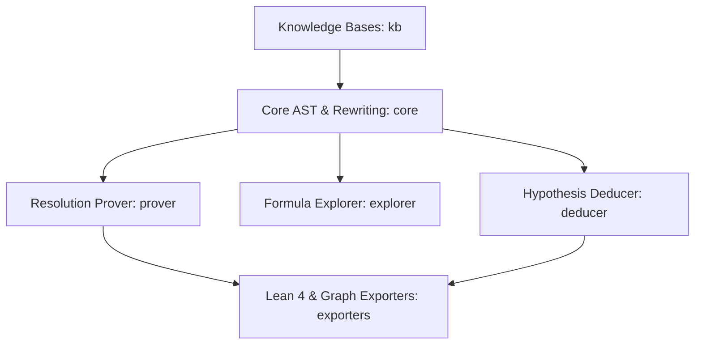

## Architecture Overview



## Submodule Directory

| Module Group | Description | Documentation |
| :--- | :--- | :--- |
| **`core`** | AST hierarchy, sorts, signature unification, substitutions & rewriting | [Read Reference →](/api/core) |
| **`prover`** | Resolution engine, given-clause loop, and proof DAG graph reconstruction | [Read Reference →](/api/prover) |
| **`explorer`** | Candidate formula generation, interestingness ranking & diversity metrics | [Read Reference →](/api/explorer) |
| **`deducer`** | Hypothesis dependency networks and minimal axiom subset detection | [Read Reference →](/api/deducer) |
| **`exporters`** | Lean 4 formal code generation and interactive HTML DAG rendering | [Read Reference →](/api/exporters) |
| **`kb`** | Axiom collections for logic, equality, arithmetic, sets, and groups | [Read Reference →](/api/kb) |
| **`sol`** | Second-Order Logic AST nodes and comprehension axiom schema | [Read Reference →](/api/sol) |
| **`config`** | Solver timeouts, resource bounds, and heuristic weights | [Read Reference →](/api/config) |
| **`utils`** | Structured logging, diagnostic tracing, and AST doc generator | [Read Reference →](/api/utils) |

## Quick Start

```python
from logic_prover.core.parser import parse_formula
from logic_prover.prover import TheoremProver

# Parse premises and target conjecture
p1 = parse_formula("forall x. (Human(x) -> Mortal(x))")
p2 = parse_formula("Human(socrates)")
conjecture = parse_formula("Mortal(socrates)")

# Prove conjecture using resolution
prover = TheoremProver(premises=[p1, p2])
result = prover.prove(conjecture)

print(f"Proved: {result.success}")
print(f"Proof Steps: {len(result.proof_steps)}")
```
