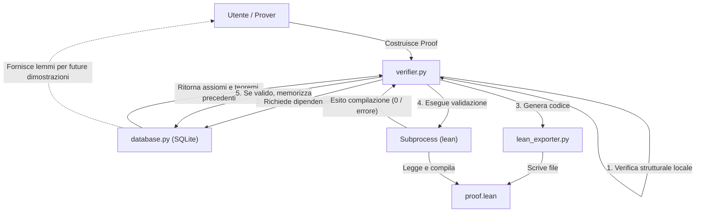
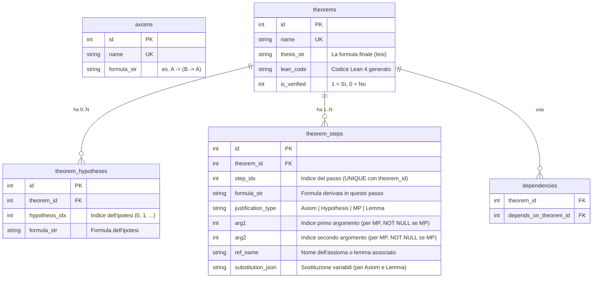

# Sistema di Calcolo di Hilbert in Python con Verifica in Lean 4

Questo piano propone la creazione di una libreria Python per modellare il calcolo di Hilbert, con la verifica formale delegata a **Lean 4** e la persistenza gestita tramite un database **SQLite** per garantire efficienza nel recupero dei teoremi e nel tracciamento delle dipendenze.

## Architettura del Sistema



Il sistema sarà suddiviso nei seguenti moduli:
1. `formula.py`: AST per formule proposizionali (variabili, negazione, implicazione) con parser da stringa, sostituzione di variabili e pattern matching per la verifica di istanze degli schemi assiomatici.
2. `database.py`: Gestore SQLite per memorizzare assiomi, teoremi dimostrati e le loro dipendenze. Risolve il problema delle performance e permette di cercare e caricare rapidamente lemmi.
3. `lean_exporter.py`: Traduttore da passaggi di dimostrazione Hilbert a codice sorgente Lean 4 self-contained (senza `import`).
4. `verifier.py`: Modulo che coordina la verifica locale, la compilazione in Lean, l'invocazione di `lean` tramite subprocess e la persistenza finale nel database.
5. `prover.py`: Interfaccia per la costruzione assistita di dimostrazioni e un algoritmo di ricerca automatica con limiti configurabili.

---

## Struttura Dettagliata del Database SQLite (`theory.db`)

Per distinguere chiaramente tra **Assiomi**, **Ipotesi**, **Tesi** e **Passi Dimostrativi**, il database SQLite utilizzerà lo schema seguente:



### Vincoli di Integrità

Lo schema SQL includerà i seguenti vincoli per prevenire dati inconsistenti:

```sql
CREATE TABLE theorem_steps (
    id INTEGER PRIMARY KEY AUTOINCREMENT,
    theorem_id INTEGER NOT NULL REFERENCES theorems(id),
    step_idx INTEGER NOT NULL,
    formula_str TEXT NOT NULL,
    justification_type TEXT NOT NULL CHECK(justification_type IN ('Axiom', 'Hypothesis', 'MP', 'Lemma')),
    arg1 INTEGER,
    arg2 INTEGER,
    ref_name TEXT,
    substitution_json TEXT,
    UNIQUE(theorem_id, step_idx),
    CHECK(justification_type != 'MP' OR (arg1 IS NOT NULL AND arg2 IS NOT NULL)),
    CHECK(justification_type != 'Axiom' OR ref_name IS NOT NULL),
    CHECK(justification_type != 'Lemma' OR ref_name IS NOT NULL)
);
```

La verifica che `arg1 < step_idx` e `arg2 < step_idx` per i passi MP verrà eseguita a livello applicativo in Python, dato che SQLite non supporta facilmente vincoli inter-riga.

### Distinzioni Chiave:
1. **Assiomi**: Sono definiti a livello globale nella tabella `axioms`. Sono schemi universali (es. `A -> (B -> A)`) privi di ipotesi e di dimostrazione. Le variabili negli schemi assiomatici sono **meta-variabili** (placeholder che possono essere sostituite con qualsiasi formula).
2. **Tesi**: È la formula che si intende dimostrare per un determinato teorema. È memorizzata nella colonna `thesis_str` della tabella `theorems`. Il passo finale di una dimostrazione (`theorem_steps` con l'indice più alto) deve coincidere con la tesi.
3. **Ipotesi**: Se un teorema viene dimostrato ipotizzando la verità di alcune formule intermedie (es. dimostrare $B$ assumendo $A$ e $A \to B$), queste formule sono registrate in `theorem_hypotheses`.
   - Nella dimostrazione, un passo può essere giustificato come `Hypothesis` facendo riferimento a una di queste ipotesi.
   - Nella traduzione in Lean, le ipotesi diventano i parametri di input del teorema (es. `theorem my_thm (h0 : A) (h1 : A → B) : B`).
4. **Dipendenze**: La tabella `dependencies` tiene traccia di quali altri teoremi (lemmi) sono stati usati come passi di tipo `Lemma` in una dimostrazione. Questo permette di caricare ricorsivamente tutti i lemmi necessari quando si genera il file Lean.
5. **Sostituzioni per Lemmi**: Quando un lemma viene usato in una dimostrazione, il campo `substitution_json` del passo di tipo `Lemma` registra la mappa di sostituzione che istanzia le variabili libere del lemma con le formule concrete della dimostrazione corrente. Questo è analogo a quanto avviene per gli assiomi.

---

## Modifiche Proposte

Creeremo i seguenti file nella cartella di progetto:

### [NEW] [formula.py](file:///c:/Users/franc/OneDrive/Programmazione/solver/formula.py)
Rappresenta l'AST (Abstract Syntax Tree) delle formule.
- Classi `Formula`, `Var(name)`, `Not(formula)`, `Implies(left, right)`.
- Supporto per la sintassi Python per facilitare la scrittura manuale (es. `p >> q` per $p \to q$ e `~p` per $\neg p$).
- Funzione `parse_formula(string)` (es. supporta `p -> (q -> p)`).
- Metodo `substitute(sub_map)` per sostituire variabili con formule.
- Metodo `free_variables()` che restituisce l'insieme di tutte le variabili presenti nella formula (raccolta ricorsiva). Necessario per la generazione Lean.
- Metodo `match_schema(schema)` per il **pattern matching** (non unificazione completa): data una formula concreta e uno schema assiomatico, trova una sostituzione delle meta-variabili dello schema che produce la formula. L'algoritmo:
  1. Attraversa ricorsivamente schema e formula in parallelo.
  2. Se il nodo dello schema è una `Var` (meta-variabile), registra il binding `nome → sotto-formula`.
  3. Se la stessa meta-variabile appare più volte, verifica che i binding siano **consistenti** (stessa sotto-formula).
  4. Se i costruttori non corrispondono (es. `Not` vs `Implies`), il match fallisce.

> **Nota**: Le variabili negli schemi assiomatici (es. `A`, `B` in `A -> (B -> A)`) sono trattate come meta-variabili. Le variabili nelle formule concrete (es. `p`, `q`) sono costanti dal punto di vista del matching. La distinzione è gestita dal contesto d'uso, non da classi separate.

### [NEW] [database.py](file:///c:/Users/franc/OneDrive/Programmazione/solver/database.py)
Gestisce la persistenza in SQLite (`theory.db`) implementando lo schema sopra descritto con i vincoli di integrità.
- Fornisce metodi per:
  - Inizializzare lo schema del DB (con `UNIQUE`, `CHECK` e `FOREIGN KEY`).
  - Registrare assiomi e teoremi con le rispettive ipotesi e passaggi.
  - Interrogare i teoremi per nome o formula.
  - Estrarre ricorsivamente l'albero delle dipendenze di un teorema.
  - Validare a livello applicativo che `arg1 < step_idx` e `arg2 < step_idx` per i passi MP prima dell'inserimento.

### [NEW] [lean_exporter.py](file:///c:/Users/franc/OneDrive/Programmazione/solver/lean_exporter.py)
Traduce una dimostrazione di Hilbert in codice Lean 4 **self-contained** (senza alcun `import`).

> **Vincolo critico**: I file `.lean` generati **non devono contenere alcun `import`**. Lean 4 può compilare file isolati (`lean proof.lean`) solo se sono completamente self-contained. Questo è possibile perché il sistema usa esclusivamente logica proposizionale con assiomi dichiarati manualmente — tutti i tipi e costrutti necessari (`Prop`, `→`, `¬`) sono built-in in Lean.

- Converte le formule proposizionali nella sintassi Lean (es. `p → q`, `¬p`).
- Raccoglie automaticamente tutte le variabili proposizionali tramite `free_variables()` dalla tesi, dalle ipotesi, da tutti i passi della dimostrazione e dalle tesi/sostituzioni dei lemmi dipendenti.
- Genera il file `.lean` includendo:
  - Assiomi della teoria con **parametri espliciti** per le variabili proposizionali:
    ```lean
    -- Ogni assioma dichiara esplicitamente i propri parametri Prop
    axiom ax1 (A B : Prop) : A → (B → A)
    axiom ax2 (A B C : Prop) : (A → (B → C)) → ((A → B) → (A → C))
    axiom ax3 (A B : Prop) : (¬A → ¬B) → (B → A)
    ```
  - Teoremi dipendenti (lemmi) recuperati da SQLite, dichiarati come `axiom` per evitare di ripetere le dimostrazioni:
    ```lean
    axiom identity (p : Prop) : p → p
    ```
  - Il teorema corrente da dimostrare: le ipotesi diventano gli argomenti e la tesi diventa il tipo di ritorno del teorema.
  - I passi di dimostrazione di Hilbert mappati come variabili locali (`let` in Lean 4):
    - Un'istanza di assioma diventa la chiamata all'assioma Lean con parametri espliciti: `let step1 : p → (q → p) := ax1 p q`.
    - Un Modus Ponens diventa un'applicazione di funzione: `let step3 : B := step2 step1`.
    - Un'ipotesi viene mappata direttamente all'argomento del teorema corrispondente: `let step0 : A := h0`.
    - Un lemma diventa l'applicazione del rispettivo teorema con le sostituzioni specificate in `substitution_json`.

### [NEW] [verifier.py](file:///c:/Users/franc/OneDrive/Programmazione/solver/verifier.py)
Verifica le dimostrazioni.
- Esegue un controllo di consistenza locale:
  - Gli indici dei passi per Modus Ponens sono validi e **strettamente antecedenti** (`arg1 < step_idx` e `arg2 < step_idx`).
  - Il formato è coerente (ogni passo ha i campi richiesti per il suo tipo di giustificazione).
  - L'ultimo passo coincide con la tesi.
- Utilizza `lean_exporter.py` per generare il codice Lean self-contained.
- Esegue il compilatore Lean via subprocess (`lean proof.lean`) sul file generato.
- **Gestione dell'output Lean**:
  - Cattura sia `stdout` che `stderr` dal subprocess.
  - Se l'exit code è 0, Lean ha validato la dimostrazione.
  - Se l'exit code è diverso da 0, parsa il messaggio di errore di Lean e lo include nel risultato restituito all'utente, indicando (se possibile) a quale passo della dimostrazione corrisponde l'errore.
- Salva il teorema e i suoi passi nel database SQLite segnandolo come `is_verified = 1`.

### [NEW] [prover.py](file:///c:/Users/franc/OneDrive/Programmazione/solver/prover.py)
Fornisce un'interfaccia interattiva a riga di comando per costruire dimostrazioni.
- Aiuta l'utente a comporre i passi e a interrogare il database SQLite per trovare lemmi utili.
- Include un algoritmo di ricerca automatica con le seguenti strategie e limiti:
  - **Strategia goal-directed**: parte dalla tesi e cerca all'indietro quali istanze di assiomi e MP possono produrla, riducendo lo spazio di ricerca.
  - **Fallback forward search (BFS)**: se la ricerca all'indietro non trova una soluzione, prova una ricerca in avanti combinando assiomi e lemmi.
  - **Limiti configurabili** per prevenire l'esplosione combinatoria:
    - `max_depth` (default: 10): numero massimo di passi nella dimostrazione cercata.
    - `max_formulas` (default: 1000): numero massimo di formule generate durante la ricerca.
    - `timeout_seconds` (default: 30): tempo massimo di esecuzione della ricerca.

### [NEW] [main.py](file:///c:/Users/franc/OneDrive/Programmazione/solver/main.py)
Script principale per testare l'intero flusso:
1. Inizializza il database SQLite con gli assiomi standard.
2. Dimostra $p \to p$ (senza ipotesi, tesi $p \to p$), traduce in Lean, compila e valida, salva in SQLite.
3. Dimostra un secondo teorema (es. $(\neg q \to \neg p) \to (p \to q)$) che fa uso di $p \to p$, recuperando quest'ultimo dal database ed esportandolo correttamente in Lean.

---

## Piano di Verifica

### Test Automatici
Creeremo un file `test_solver.py`:
- Test del parser e del pattern matching delle formule (inclusa la consistenza dei binding delle meta-variabili).
- Test di `free_variables()` su formule composte.
- Test del database: inserimento, ricerca, vincoli di integrità e risoluzione ricorsiva delle dipendenze.
- Test di traduzione ed esecuzione Lean:
  - Dimostrazione corretta $\to$ Lean compila con successo.
  - Dimostrazione errata (es. MP con tipi non corrispondenti) $\to$ Lean fallisce e il messaggio di errore viene catturato e restituito.
- Esecuzione dei test con `python test_solver.py`.

### Requisiti di Sistema
- **Lean 4** installato sul sistema (verificato tramite il comando `lean --version`).
- **Python 3.8+** con modulo `sqlite3` (incluso nella libreria standard).
