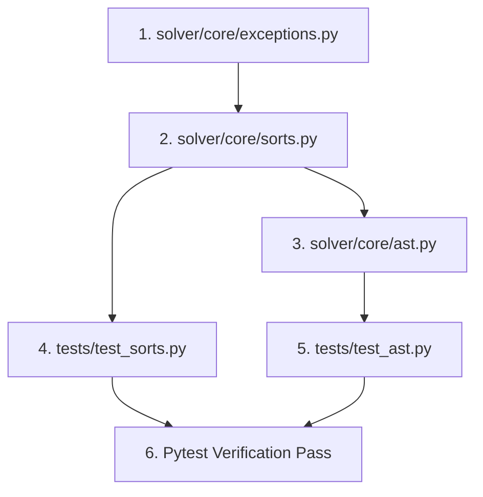

# Phase 1 — AST & Sort System Implementation Plan

> **Phase Goal**: Implement a robust, immutable Abstract Syntax Tree (AST) for First-Order Logic (FOL) with parameterized sorts, canonical bound variable renaming, term/formula metadata algorithms, and a centralized exception hierarchy.

---

## 1. Overview & Architecture Strategy

Phase 1 provides the foundational data structures and core type system upon which all higher-level solver logic (unification, validation, proof search, formula exploration, parsing, and exports) relies.

### Key Architectural Decisions:
1. **Immutable Frozen Dataclasses**: All AST nodes (`Term` and `Formula` subclasses) and Sort structures (`Sort` subclasses) are implemented using `@dataclass(frozen=True)`. This automatically generates structural `__eq__` and structural `__hash__`, allowing formulas, terms, and sorts to be stored in sets, used as dictionary keys, and deduplicated efficiently.
2. **Infinite Indexed Variables**: Individual variables are represented as $v_n$ where $n \ge 0$ (`id: int`). Variables are further annotated with a `sort: Sort` (defaulting to `Ind`) and a `kind: VariableKind` enum (`INDIVIDUAL`, `PREDICATE`, `FUNCTION`).
3. **Multi-Sort System**: Sorts support atomic primitive types (`PrimitiveSort`), parameterized composite types like `Set(Nat)` or `Pair(Nat, Bool)` (`ParameterizedSort`), and function types (`FunctionSort`, reserved for SOL extensions). `Ind` (Individual) serves as the default individual sort and unifies flexibly as a wildcard for individual sorts.
4. **Canonical Bound Variable Renaming**: `canonicalize_bound_variables(formula)` performs canonical alpha-conversion on **bound variables only** using sequential indexing ($v_0, v_1, v_2, \dots$), while strictly preserving the identities of free variables. This avoids false alpha-equivalence between formulas like $P(x, y)$ and $P(y, x)$ while guaranteeing that alpha-equivalent closed/scoped formulas yield identical AST structures and hashes.

---

## 2. Prerequisites

- **Dependencies**: None (this is Phase 1, the foundational module).
- **Python Version**: Python 3.10+ (utilizing `dataclasses`, `enum`, `typing`, `abc`).
- **Testing Tools**: `pytest`, `pytest-cov`, and `hypothesis` for property-based invariant testing.

---

## 3. Files to Create

```
solver/
├── core/
│   ├── exceptions.py          # Exception hierarchy for solver operations
│   ├── sorts.py               # Sort system (Primitive, Parameterized, FunctionSort)
│   └── ast.py                 # AST nodes for Terms & Formulas, and AST utilities
tests/
├── test_sorts.py              # Unit tests for sort creation and compatibility
└── test_ast.py                # Unit & property-based tests for AST nodes and canonicalization
```

---

## 4. Detailed Module Specifications

### 4.1 `solver/core/exceptions.py`

Defines the base and specialized exception classes for error handling across the entire library.

#### Class Signatures & Hierarchy:

```python
class SolverError(Exception):
    """Base exception for all errors raised by the solver library."""
    def __init__(self, message: str) -> None:
        super().__init__(message)
        self.message = message

class ParseError(SolverError):
    """Raised when parsing formula or term text fails due to syntax or token errors."""
    pass

class UnificationError(SolverError):
    """Raised when term or formula unification fails."""
    pass

class SortMismatchError(UnificationError):
    """Raised when terms or expressions of incompatible sorts are combined or unified."""
    def __init__(self, message: str, expected_sort: Optional["Sort"] = None, actual_sort: Optional["Sort"] = None) -> None:
        super().__init__(message)
        self.expected_sort = expected_sort
        self.actual_sort = actual_sort

class ProofTimeoutError(SolverError):
    """Raised when automated proof search exceeds the allocated time limit."""
    pass

class ProofSearchExhaustedError(SolverError):
    """Raised when proof search completes without finding a proof or refutation."""
    pass

class InvalidFormulaError(SolverError):
    """Raised when constructing an ill-formed AST node (e.g. arity mismatch, invalid ID)."""
    pass

class ValidationError(SolverError):
    """Raised when AST validation checks fail (e.g., sort mismatch, unbound index)."""
    pass

class DatabaseError(SolverError):
    """Raised when persistence operations (SQLite I/O, schema errors, serialization) fail."""
    pass
```

---

### 4.2 `solver/core/sorts.py`

Defines the multi-sort logic hierarchy supporting atomic sorts, parameterized sorts, and sort compatibility checking.

#### Implementation Details & Classes:

```python
from __future__ import annotations
from abc import ABC, abstractmethod
from dataclasses import dataclass
from typing import Tuple, Optional, Dict, TYPE_CHECKING

if TYPE_CHECKING:
    from solver.core.ast import Term

@dataclass(frozen=True)
class Sort(ABC):
    """Abstract Base Class for logical sorts."""
    @property
    @abstractmethod
    def name(self) -> str:
        """Returns the canonical string representation of the sort."""
        pass

    def __str__(self) -> str:
        return self.name

@dataclass(frozen=True)
class PrimitiveSort(Sort):
    """Represents an atomic sort (e.g. Ind, Nat, Bool)."""
    sort_name: str

    def __post_init__(self) -> None:
        if not self.sort_name or not isinstance(self.sort_name, str):
            raise InvalidFormulaError("PrimitiveSort name must be a non-empty string.")

    @property
    def name(self) -> str:
        return self.sort_name

@dataclass(frozen=True)
class ParameterizedSort(Sort):
    """Represents a composite parameterized sort (e.g., Set(Nat), Pair(Nat, Bool))."""
    constructor: str
    args: Tuple[Sort, ...]

    def __post_init__(self) -> None:
        if not self.constructor:
            raise InvalidFormulaError("ParameterizedSort constructor cannot be empty.")
        if not self.args:
            raise InvalidFormulaError("ParameterizedSort must have at least one argument sort.")

    @property
    def name(self) -> str:
        args_str = ", ".join(arg.name for arg in self.args)
        return f"{self.constructor}({args_str})"

@dataclass(frozen=True)
class FunctionSort(Sort):
    """Represents a function sort (domain sorts -> codomain sort). Reserved for SOL extensions."""
    arg_sorts: Tuple[Sort, ...]
    return_sort: Sort

    @property
    def name(self) -> str:
        args_str = ", ".join(arg.name for arg in self.arg_sorts)
        return f"({args_str}) -> {self.return_sort.name}"
```

#### Built-in Sort Constants & Constructors:

```python
# Atomic primitive sorts
Ind: PrimitiveSort = PrimitiveSort("Ind")
Nat: PrimitiveSort = PrimitiveSort("Nat")
Bool: PrimitiveSort = PrimitiveSort("Bool")

# Helper constructors for parameterized sorts
def SetSort(element_sort: Sort) -> ParameterizedSort:
    return ParameterizedSort("Set", (element_sort,))

def ListSort(element_sort: Sort) -> ParameterizedSort:
    return ParameterizedSort("List", (element_sort,))

def PairSort(sort_a: Sort, sort_b: Sort) -> ParameterizedSort:
    return ParameterizedSort("Pair", (sort_a, sort_b))
```

#### Functions:

```python
def is_compatible(s1: Sort, s2: Sort) -> bool:
    """
    Determines if two sorts are compatible for unification and term assignment.
    
    Rules:
    1. Identity: If s1 == s2, returns True.
    2. Wildcard: Ind is compatible with all individual primitive and parameterized sorts.
    3. Primitive: Two PrimitiveSorts must match names or involve Ind.
    4. Parameterized: Same constructor, same arity, and recursively compatible arguments.
    5. FunctionSort: Same argument arity, recursively compatible argument sorts and return sorts.
    """
    if s1 == s2:
        return True
    
    # Generic individual sort wildcard rule
    if (s1 == Ind or s2 == Ind) and not isinstance(s1, FunctionSort) and not isinstance(s2, FunctionSort):
        return True

    if isinstance(s1, PrimitiveSort) and isinstance(s2, PrimitiveSort):
        return s1.sort_name == s2.sort_name

    if isinstance(s1, ParameterizedSort) and isinstance(s2, ParameterizedSort):
        if s1.constructor != s2.constructor or len(s1.args) != len(s2.args):
            return False
        return all(is_compatible(a1, a2) for a1, a2 in zip(s1.args, s2.args))

    if isinstance(s1, FunctionSort) and isinstance(s2, FunctionSort):
        if len(s1.arg_sorts) != len(s2.arg_sorts):
            return False
        if not is_compatible(s1.return_sort, s2.return_sort):
            return False
        return all(is_compatible(a1, a2) for a1, a2 in zip(s1.arg_sorts, s2.arg_sorts))

    return False

def sort_of_term(term: Term, context: Optional[Dict[str, Sort]] = None) -> Sort:
    """
    Infers the sort of a Term node.
    
    - Variable: term.sort
    - Constant: term.sort or lookup in context if context provided
    - FunctionApp: term.return_sort or lookup function return sort in context
    """
    from solver.core.ast import Variable, Constant, FunctionApp
    
    if isinstance(term, Variable):
        return term.sort
    elif isinstance(term, Constant):
        if context and term.name in context:
            return context[term.name]
        return term.sort
    elif isinstance(term, FunctionApp):
        if context and term.func in context:
            func_sort = context[term.func]
            if isinstance(func_sort, FunctionSort):
                return func_sort.return_sort
        return term.return_sort
    else:
        raise InvalidFormulaError(f"Cannot infer sort for unknown term type: {type(term)}")
```

---

### 4.3 `solver/core/ast.py`

Defines AST nodes for FOL terms, formulas, variable scope collectors, formula depth/size algorithms, and canonical bound variable renaming.

#### Enums & Base Classes:

```python
from __future__ import annotations
from abc import ABC
from dataclasses import dataclass
from enum import Enum, auto
from typing import Tuple, Set, Union, Dict, Optional
from solver.core.sorts import Sort, Ind
from solver.core.exceptions import InvalidFormulaError

class VariableKind(Enum):
    """Distinguishes variable usage in logic expressions."""
    INDIVIDUAL = "INDIVIDUAL"
    PREDICATE = "PREDICATE"
    FUNCTION = "FUNCTION"

@dataclass(frozen=True)
class Term(ABC):
    """Abstract Base Class for all term AST nodes."""
    sort: Sort = Ind

@dataclass(frozen=True)
class Formula(ABC):
    """Abstract Base Class for all formula AST nodes."""
    pass
```

#### Concrete Term Nodes:

```python
@dataclass(frozen=True)
class Variable(Term):
    """Represents an individual variable v_id with an integer index, sort, and kind."""
    id: int
    sort: Sort = Ind
    kind: VariableKind = VariableKind.INDIVIDUAL

    def __post_init__(self) -> None:
        if self.id < 0:
            raise InvalidFormulaError(f"Variable ID must be non-negative, got {self.id}.")

@dataclass(frozen=True)
class Constant(Term):
    """Represents a constant symbol c_name with a sort annotation."""
    name: str
    sort: Sort = Ind

    def __post_init__(self) -> None:
        if not self.name:
            raise InvalidFormulaError("Constant name cannot be empty.")

@dataclass(frozen=True)
class FunctionApp(Term):
    """Represents function application f(t_1, ..., t_k)."""
    func: str
    arity: int
    args: Tuple[Term, ...]
    return_sort: Sort = Ind

    def __post_init__(self) -> None:
        if not self.func:
            raise InvalidFormulaError("Function name cannot be empty.")
        if self.arity < 0:
            raise InvalidFormulaError(f"Function arity must be non-negative, got {self.arity}.")
        if len(self.args) != self.arity:
            raise InvalidFormulaError(f"FunctionApp '{self.func}' expected arity {self.arity}, got {len(self.args)} arguments.")
        # Ensure underlying term sort matches return_sort
        object.__setattr__(self, 'sort', self.return_sort)
```

#### Concrete Formula Nodes:

```python
@dataclass(frozen=True)
class PredicateApp(Formula):
    """Represents predicate application P(t_1, ..., t_k)."""
    pred: str
    arity: int
    args: Tuple[Term, ...]

    def __post_init__(self) -> None:
        if not self.pred:
            raise InvalidFormulaError("Predicate name cannot be empty.")
        if self.arity < 0:
            raise InvalidFormulaError(f"Predicate arity must be non-negative, got {self.arity}.")
        if len(self.args) != self.arity:
            raise InvalidFormulaError(f"PredicateApp '{self.pred}' expected arity {self.arity}, got {len(self.args)} arguments.")

@dataclass(frozen=True)
class Equality(Formula):
    """Represents term equality t_1 = t_2."""
    left: Term
    right: Term

@dataclass(frozen=True)
class Not(Formula):
    """Represents logical negation ~operand."""
    operand: Formula

@dataclass(frozen=True)
class And(Formula):
    """Represents logical conjunction left & right."""
    left: Formula
    right: Formula

@dataclass(frozen=True)
class Or(Formula):
    """Represents logical disjunction left | right."""
    left: Formula
    right: Formula

@dataclass(frozen=True)
class Implies(Formula):
    """Represents logical implication left => right."""
    left: Formula
    right: Formula

@dataclass(frozen=True)
class Iff(Formula):
    """Represents logical equivalence left <=> right."""
    left: Formula
    right: Formula

@dataclass(frozen=True)
class Forall(Formula):
    """Represents universal quantification forall variable. body."""
    variable: Variable
    body: Formula

@dataclass(frozen=True)
class Exists(Formula):
    """Represents existential quantification exists variable. body."""
    variable: Variable
    body: Formula
```

---

#### Standalone AST Utility Functions:

```python
def free_variables(node: Union[Term, Formula]) -> Set[Variable]:
    """
    Returns the set of free individual variables present in a term or formula AST node.
    """
    if isinstance(node, Variable):
        return {node}
    elif isinstance(node, Constant):
        return set()
    elif isinstance(node, FunctionApp):
        res: Set[Variable] = set()
        for arg in node.args:
            res.update(free_variables(arg))
        return res
    elif isinstance(node, PredicateApp):
        res: Set[Variable] = set()
        for arg in node.args:
            res.update(free_variables(arg))
        return res
    elif isinstance(node, Equality):
        return free_variables(node.left) | free_variables(node.right)
    elif isinstance(node, Not):
        return free_variables(node.operand)
    elif isinstance(node, (And, Or, Implies, Iff)):
        return free_variables(node.left) | free_variables(node.right)
    elif isinstance(node, (Forall, Exists)):
        return free_variables(node.body) - {node.variable}
    else:
        raise InvalidFormulaError(f"Unsupported AST node type: {type(node)}")

def bound_variables(node: Union[Term, Formula]) -> Set[Variable]:
    """
    Returns the set of bound variables introduced by quantifiers in a formula AST node.
    """
    if isinstance(node, (Variable, Constant, FunctionApp, PredicateApp, Equality)):
        return set()
    elif isinstance(node, Not):
        return bound_variables(node.operand)
    elif isinstance(node, (And, Or, Implies, Iff)):
        return bound_variables(node.left) | bound_variables(node.right)
    elif isinstance(node, (Forall, Exists)):
        return {node.variable} | bound_variables(node.body)
    else:
        raise InvalidFormulaError(f"Unsupported AST node type: {type(node)}")

def formula_depth(formula: Formula) -> int:
    """
    Computes the maximum height/depth of the formula AST.
    Leaf formula nodes (PredicateApp, Equality) have depth 1.
    """
    if isinstance(formula, (PredicateApp, Equality)):
        return 1
    elif isinstance(formula, Not):
        return 1 + formula_depth(formula.operand)
    elif isinstance(formula, (And, Or, Implies, Iff)):
        return 1 + max(formula_depth(formula.left), formula_depth(formula.right))
    elif isinstance(formula, (Forall, Exists)):
        return 1 + formula_depth(formula.body)
    else:
        raise InvalidFormulaError(f"Expected Formula, got {type(formula)}")

def formula_size(formula: Formula) -> int:
    """
    Computes the total number of AST nodes (both Formula and Term nodes) in a formula tree.
    """
    def _term_size(term: Term) -> int:
        if isinstance(term, (Variable, Constant)):
            return 1
        elif isinstance(term, FunctionApp):
            return 1 + sum(_term_size(arg) for arg in term.args)
        return 1

    if isinstance(formula, PredicateApp):
        return 1 + sum(_term_size(arg) for arg in formula.args)
    elif isinstance(formula, Equality):
        return 1 + _term_size(formula.left) + _term_size(formula.right)
    elif isinstance(formula, Not):
        return 1 + formula_size(formula.operand)
    elif isinstance(formula, (And, Or, Implies, Iff)):
        return 1 + formula_size(formula.left) + formula_size(formula.right)
    elif isinstance(formula, (Forall, Exists)):
        return 1 + _term_size(formula.variable) + formula_size(formula.body)
    else:
        raise InvalidFormulaError(f"Expected Formula, got {type(formula)}")
```

---

#### Canonicalization Algorithm (`canonicalize_bound_variables`):

> **Design Invariant**: Canonicalization renames **bound variables only**, mapping them sequentially to indices $v_0, v_1, v_2, \dots$ in top-down, left-to-right binder appearance order, while skipping any indices that belong to the formula's free variables (`free_ids`). Free variable identity is strictly preserved.

```python
def canonicalize_bound_variables(formula: Formula) -> Formula:
    """
    Performs canonical alpha-conversion of bound variables in a formula.
    
    Free variables retain their original IDs and sorts.
    Bound variables are renamed sequentially (v_0, v_1, ...) skipping free variable IDs.
    
    Guarantees:
    1. Idempotency: canonicalize(canonicalize(f)) == canonicalize(f)
    2. Alpha-equivalence: If f1 and f2 are alpha-equivalent, canonicalize(f1) == canonicalize(f2)
    3. Free variable preservation: free_variables(canonicalize(f)) == free_variables(f)
    """
    free_vars = free_variables(formula)
    free_ids = {v.id for v in free_vars}

    # Stack to manage next available canonical ID, skipping free_ids
    class IndexGenerator:
        def __init__(self, reserved: Set[int]) -> None:
            self.reserved = reserved
            self.current = 0

        def get_next(self) -> int:
            while self.current in self.reserved:
                self.current += 1
            idx = self.current
            self.current += 1
            return idx

    gen = IndexGenerator(free_ids)

    def _canonicalize_term(t: Term, env: Dict[Variable, Variable]) -> Term:
        if isinstance(t, Variable):
            return env.get(t, t)
        elif isinstance(t, Constant):
            return t
        elif isinstance(t, FunctionApp):
            new_args = tuple(_canonicalize_term(arg, env) for arg in t.args)
            return FunctionApp(func=t.func, arity=t.arity, args=new_args, return_sort=t.return_sort)
        return t

    def _canonicalize_formula(f: Formula, env: Dict[Variable, Variable]) -> Formula:
        if isinstance(f, PredicateApp):
            new_args = tuple(_canonicalize_term(arg, env) for arg in f.args)
            return PredicateApp(pred=f.pred, arity=f.arity, args=new_args)
        elif isinstance(f, Equality):
            return Equality(left=_canonicalize_term(f.left, env), right=_canonicalize_term(f.right, env))
        elif isinstance(f, Not):
            return Not(operand=_canonicalize_formula(f.operand, env))
        elif isinstance(f, And):
            return And(left=_canonicalize_formula(f.left, env), right=_canonicalize_formula(f.right, env))
        elif isinstance(f, Or):
            return Or(left=_canonicalize_formula(f.left, env), right=_canonicalize_formula(f.right, env))
        elif isinstance(f, Implies):
            return Implies(left=_canonicalize_formula(f.left, env), right=_canonicalize_formula(f.right, env))
        elif isinstance(f, Iff):
            return Iff(left=_canonicalize_formula(f.left, env), right=_canonicalize_formula(f.right, env))
        elif isinstance(f, Forall):
            new_id = gen.get_next()
            canon_var = Variable(id=new_id, sort=f.variable.sort, kind=f.variable.kind)
            new_env = dict(env)
            new_env[f.variable] = canon_var
            return Forall(variable=canon_var, body=_canonicalize_formula(f.body, new_env))
        elif isinstance(f, Exists):
            new_id = gen.get_next()
            canon_var = Variable(id=new_id, sort=f.variable.sort, kind=f.variable.kind)
            new_env = dict(env)
            new_env[f.variable] = canon_var
            return Exists(variable=canon_var, body=_canonicalize_formula(f.body, new_env))
        else:
            raise InvalidFormulaError(f"Unsupported Formula node: {type(f)}")

    return _canonicalize_formula(formula, {})
```

---

## 5. Step-by-Step Implementation Order within Phase 1



1. **Step 1: Implement `solver/core/exceptions.py`**
   - Rationale: Base exceptions are referenced by validation checks in `sorts.py` and `ast.py`.
2. **Step 2: Implement `solver/core/sorts.py`**
   - Rationale: Dataclasses for `PrimitiveSort`, `ParameterizedSort`, `FunctionSort`, built-in sort constants (`Ind`, `Nat`, `Bool`), parameterized helpers, and `is_compatible`.
3. **Step 3: Implement `solver/core/ast.py`**
   - Rationale: `Term` and `Formula` hierarchies, dataclass validation in `__post_init__`, scope collectors (`free_variables`, `bound_variables`), depth/size calculations, and `canonicalize_bound_variables`.
4. **Step 4: Implement `tests/test_sorts.py`**
   - Rationale: Validate primitive and parameterized sort creation, reflexivity, `Ind` wildcard behavior, and nested parameterized sort compatibility.
5. **Step 5: Implement `tests/test_ast.py`**
   - Rationale: Unit and property-based tests using `hypothesis` to verify structural equality, immutability, scope collection, depth, size, and bound variable canonicalization invariants.
6. **Step 6: Execute Test Suite & Verify Coverage**
   - Command: `pytest --cov=solver/core tests/`

---

## 6. Testing Requirements

### 6.1 Sort Tests (`tests/test_sorts.py`)

- **Primitive Sorts**: Verify `Ind`, `Nat`, `Bool` creation, naming, string representation, and immutability.
- **Parameterized Sorts**:
  - Verify `SetSort(Nat)`, `ListSort(Bool)`, `PairSort(Nat, Ind)`.
  - Verify nested parameterized sorts: `SetSort(SetSort(Nat))` produces `"Set(Set(Nat))"`.
- **Sort Compatibility (`is_compatible`)**:
  - `is_compatible(Nat, Nat)` is `True`.
  - `is_compatible(Nat, Bool)` is `False`.
  - `is_compatible(Ind, Nat)` and `is_compatible(Nat, Ind)` are `True`.
  - `is_compatible(Set(Nat), Set(Nat))` is `True`.
  - `is_compatible(Set(Nat), Set(Bool))` is `False`.
  - `is_compatible(Set(Ind), Set(Nat))` is `True` (recursive wildcard compatibility).
  - `is_compatible(Set(Nat), List(Nat))` is `False` (constructor mismatch).

### 6.2 AST Tests (`tests/test_ast.py`)

- **Construction & Invariants**:
  - Valid construction of all AST node types (`Variable`, `Constant`, `FunctionApp`, `PredicateApp`, `Equality`, `Not`, `And`, `Or`, `Implies`, `Iff`, `Forall`, `Exists`).
  - Expect `InvalidFormulaError` when:
    - `Variable` index is negative (`id < 0`).
    - Symbol names are empty strings.
    - `FunctionApp` or `PredicateApp` arity doesn't match `len(args)`.
- **Immutability & Hashing**:
  - Confirm AST nodes are frozen and can be added to standard Python `set`s or used as dictionary keys.
  - Verify `node1 == node2` and `hash(node1) == hash(node2)` for identical structural terms/formulas.
- **Variable Scope Extraction**:
  - `free_variables(Forall(v1, PredicateApp("P", 2, (v1, v0))))` returns `{v0}`.
  - `bound_variables(Forall(v1, Exists(v2, Equality(v1, v2))))` returns `{v1, v2}`.
- **Property-Based Testing (Hypothesis)**:
  - **Idempotency**: `canonicalize_bound_variables(canonicalize_bound_variables(f)) == canonicalize_bound_variables(f)`.
  - **Alpha-Equivalence Equality**: For alpha-equivalent formulas `f1` and `f2` (e.g. $\forall v_5. P(v_5)$ and $\forall v_{99}. P(v_{99})$), `canonicalize_bound_variables(f1) == canonicalize_bound_variables(f2)`.
  - **Free Variable Preservation**: `free_variables(canonicalize_bound_variables(f)) == free_variables(f)`.
  - **Free Variable Non-Collision**: Formula $\forall v_2. P(v_0, v_2)$ canonicalizes to $\forall v_1. P(v_0, v_1)$ when $v_0$ is free, preserving $v_0$.
- **AST Metrics**:
  - Verify `formula_depth` and `formula_size` on nested formulas.

---

## 7. Acceptance Criteria

- [ ] All 5 deliverables (`solver/core/exceptions.py`, `solver/core/sorts.py`, `solver/core/ast.py`, `tests/test_sorts.py`, `tests/test_ast.py`) are fully implemented with 100% type annotations (`mypy` compliant).
- [ ] FOL formulas can be constructed, hashed, compared, and placed in Python `set` / `dict` structures.
- [ ] Parameterized sorts (`Set(Nat)`, `Pair(Nat, Bool)`) instantiate and support recursive compatibility checking via `is_compatible`.
- [ ] `canonicalize_bound_variables` is provably idempotent, preserves free variable identities, and maps alpha-equivalent formulas to identical canonical ASTs.
- [ ] Automated test suite (`pytest`) runs cleanly with 100% pass rate.

---

## 8. Risks & Mitigations

| Potential Risk | Impact | Mitigation Strategy |
| :--- | :--- | :--- |
| **Bound variable ID collision with free variables** | High (corrupts formula semantics during canonicalization) | Algorithm explicitly computes `free_ids` and skips any canonical index present in `free_ids`. |
| **Dataclass mutation side-effects** | High (breaks hashability in sets/dicts) | Enforce `@dataclass(frozen=True)` on all AST nodes and Sort structures. |
| **Recursion depth limit on deep ASTs** | Medium (Causes `RecursionError` on large generated formulas) | Implement structural recursion cleanly; in later phases visitor traversals will handle deep trees. |
| **Sort compatibility asymmetry** | Medium (Inconsistent type checking) | Rigorously test reflexivity and symmetric `Ind` wildcard matching in `test_sorts.py`. |
