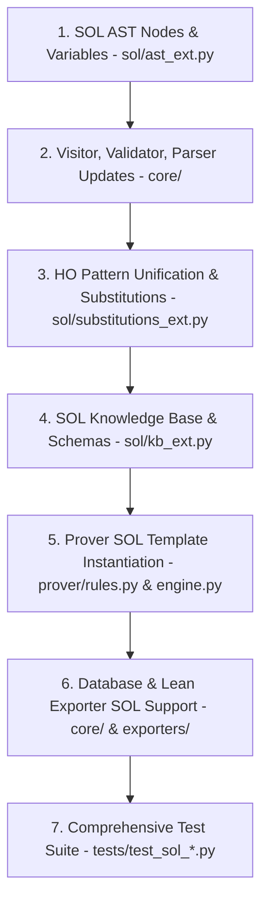

# Phase 11 — Second-Order Logic Extension Implementation Plan

**Goal**: Implement Second-Order Logic (SOL) Abstract Syntax Tree (AST) extensions, higher-order pattern unification (Miller-Pfenning algorithm), SOL predicate and function substitutions, SOL knowledge base axioms (Comprehension and Induction Schemas), and integrate SOL template instantiation into the automated theorem prover, validator, visitors, parser, database, and Lean 4 exporter.

**Deliverables**:
- [solver/sol/__init__.py](file:///C:/Users/franc/Programmazione/solver/solver/sol/__init__.py)
- [solver/sol/ast_ext.py](file:///C:/Users/franc/Programmazione/solver/solver/sol/ast_ext.py)
- [solver/sol/substitutions_ext.py](file:///C:/Users/franc/Programmazione/solver/solver/sol/substitutions_ext.py)
- [solver/sol/kb_ext.py](file:///C:/Users/franc/Programmazione/solver/solver/sol/kb_ext.py)
- Extensions in core modules: [solver/core/visitors.py](file:///C:/Users/franc/Programmazione/solver/solver/core/visitors.py), [solver/core/validator.py](file:///C:/Users/franc/Programmazione/solver/solver/core/validator.py), [solver/core/parser.py](file:///C:/Users/franc/Programmazione/solver/solver/core/parser.py), [solver/core/database.py](file:///C:/Users/franc/Programmazione/solver/solver/core/database.py)
- Prover integration: [solver/prover/rules.py](file:///C:/Users/franc/Programmazione/solver/solver/prover/rules.py), [solver/prover/engine.py](file:///C:/Users/franc/Programmazione/solver/solver/prover/engine.py)
- Lean 4 exporter integration: [solver/exporters/lean_exporter.py](file:///C:/Users/franc/Programmazione/solver/solver/exporters/lean_exporter.py)
- Unit and integration test suite: [tests/test_sol_ast.py](file:///C:/Users/franc/Programmazione/solver/tests/test_sol_ast.py), [tests/test_sol_substitutions.py](file:///C:/Users/franc/Programmazione/solver/tests/test_sol_substitutions.py), [tests/test_sol_kb.py](file:///C:/Users/franc/Programmazione/solver/tests/test_sol_kb.py), [tests/test_sol_prover.py](file:///C:/Users/franc/Programmazione/solver/tests/test_sol_prover.py)

---

## 1. Overview & Architectural Goals

Phase 11 extends the `solver` library beyond First-Order Logic (FOL) by incorporating Second-Order Logic (SOL) capabilities. As noted in Section 2.4 and Section 3.11 of the master plan, full higher-order unification (Huet's algorithm) is undecidable and incurs infinite search spaces. To retain decidability, predictability, and high performance, Phase 11 restricts automated SOL reasoning to **higher-order pattern unification (Miller-Pfenning)** and **explicit template instantiation**.

### Key Architectural Decisions & Scope Restrictions:
1. **Scope Restriction (Miller-Pfenning Pattern Fragment)**:
   Higher-order unification is strictly restricted to expressions in pattern form: higher-order predicate variables $P$ or function variables $F$ applied to a sequence of *distinct bound variables* $x_1, \dots, x_k$ (e.g. $P(x_1, \dots, x_k)$). Unification over non-pattern terms is rejected immediately with `UnificationError`. Pattern unification is decidable, unitary (produces a single most general unifier), and linear-time.
2. **Transparent AST Generalization**:
   In [solver/core/ast.py](file:///C:/Users/franc/Programmazione/solver/solver/core/ast.py), `PredicateApp.pred` and `FunctionApp.func` are extended from `str` to `Union[str, PredicateVariable]` and `Union[str, FunctionVariable]` respectively. This allows predicate and function applications with quantifiable variable symbols to seamlessly enter the AST without breaking existing FOL term structures.
3. **Second-Order Quantifiers**:
   Introduces `ForallPred`, `ExistsPred`, `ForallFunc`, and `ExistsFunc` for quantification over predicate variables $P_n$ and function variables $F_n$.
4. **Capture-Avoiding Higher-Order Substitution & Beta-Reduction**:
   Substituting a predicate variable $P$ with a formula template $\phi(x_1, \dots, x_k)$ performs parameter substitution ($x_i \mapsto t_i$) accompanied by full alpha-conversion to prevent bound variable capture.
5. **Prover SOL Template Instantiation**:
   The resolution engine is enhanced with a dedicated inference rule (`SOLInstantiateRule`) that matches target proof goals against SOL schemas (such as Peano Induction or SOL Comprehension) using higher-order pattern matching, instantiating ground FOL clauses for the CNF resolution solver.

---

## 2. Prerequisites

The following phases must be completed and fully verified prior to Phase 11:

1. **Phase 1 — AST & Sort System**:
   - Immutable AST nodes (`Term`, `Formula`, `Variable`, `Constant`, `FunctionApp`, `PredicateApp`, `Equality`, `Not`, `And`, `Or`, `Implies`, `Iff`, `Forall`, `Exists`), `Sort` hierarchy.
2. **Phase 2 — Signature & Validator**:
   - `Signature` registration and `FormulaValidator` sort-checking.
3. **Phase 3 — Visitor Framework & Parser**:
   - `ASTVisitor`, `ASTTransformer`, `parse_formula()`, `to_string()`.
4. **Phase 4 — Substitution & Unification**:
   - First-order `substitute_term()`, `substitute_formula()`, `unify_terms()`, `unify_formulas()`.
5. **Phase 5 — Equality & Rewriting**:
   - Congruence closure engine and term rewriter.
6. **Phase 6 — Knowledge Base & Database**:
   - Persistence layer and foundational FOL knowledge bases (`solver/kb/`).
7. **Phase 7 — Theorem Prover**:
   - Clausification engine, resolution rules, and `TheoremProver` given-clause loop.
8. **Phase 8, 9, 10 — Explorer, Deducer & Exporters**:
   - Formula generator, dependency analyzer, and Lean 4 exporter.

---

## 3. Files to Create / Modify

| File Path | Action | Description |
| :--- | :--- | :--- |
| [solver/sol/__init__.py](file:///C:/Users/franc/Programmazione/solver/solver/sol/__init__.py) | Create | Package initialization; exposes SOL AST nodes, substitutions, KB, and prover rules |
| [solver/sol/ast_ext.py](file:///C:/Users/franc/Programmazione/solver/solver/sol/ast_ext.py) | Create | `PredicateVariable`, `FunctionVariable`, `ForallPred`, `ExistsPred`, `ForallFunc`, `ExistsFunc`, and SOL variable extraction utilities |
| [solver/sol/substitutions_ext.py](file:///C:/Users/franc/Programmazione/solver/solver/sol/substitutions_ext.py) | Create | Miller-Pfenning higher-order pattern unification (`ho_pattern_unify`), `substitute_predicate`, `substitute_function`, `beta_reduce`, `is_ho_pattern` |
| [solver/sol/kb_ext.py](file:///C:/Users/franc/Programmazione/solver/solver/sol/kb_ext.py) | Create | `get_sol_axioms()`, `instantiate_comprehension()`, `instantiate_induction()` |
| [solver/core/ast.py](file:///C:/Users/franc/Programmazione/solver/solver/core/ast.py) | Modify | Generalize `FunctionApp.func` and `PredicateApp.pred` to support `FunctionVariable` and `PredicateVariable` |
| [solver/core/visitors.py](file:///C:/Users/franc/Programmazione/solver/solver/core/visitors.py) | Modify | Extend `ASTVisitor` and `ASTTransformer` with methods for SOL quantifier nodes |
| [solver/core/validator.py](file:///C:/Users/franc/Programmazione/solver/solver/core/validator.py) | Modify | Extend `FormulaValidator` to validate SOL quantifiers, arity matching, and variable sort signatures |
| [solver/core/parser.py](file:///C:/Users/franc/Programmazione/solver/solver/core/parser.py) | Modify | Extend parser and lexer for SOL symbols (`P_n`, `F_n`) and quantifiers (`FORALL_PRED`, `EXISTS_PRED`, `FORALL_FUNC`, `EXISTS_FUNC`) |
| [solver/core/database.py](file:///C:/Users/franc/Programmazione/solver/solver/core/database.py) | Modify | Ensure SQLite serialization and deserialization handle SOL AST nodes |
| [solver/prover/rules.py](file:///C:/Users/franc/Programmazione/solver/solver/prover/rules.py) | Modify | Implement `SOLInstantiateRule` for higher-order template matching and ground FOL clause generation |
| [solver/prover/engine.py](file:///C:/Users/franc/Programmazione/solver/solver/prover/engine.py) | Modify | Integrate `SOLInstantiateRule` into the given-clause resolution loop |
| [solver/exporters/lean_exporter.py](file:///C:/Users/franc/Programmazione/solver/solver/exporters/lean_exporter.py) | Modify | Translate SOL quantifiers and predicate applications to Lean 4 syntax |
| [tests/test_sol_ast.py](file:///C:/Users/franc/Programmazione/solver/tests/test_sol_ast.py) | Create | Unit tests for SOL AST nodes, immutability, structural hashing, and variable extraction |
| [tests/test_sol_substitutions.py](file:///C:/Users/franc/Programmazione/solver/tests/test_sol_substitutions.py) | Create | Unit tests for Miller-Pfenning pattern unification, predicate/function substitutions, beta-reduction, and scope checks |
| [tests/test_sol_kb.py](file:///C:/Users/franc/Programmazione/solver/tests/test_sol_kb.py) | Create | Unit tests for SOL core axioms, Comprehension instantiation, and Induction instantiation |
| [tests/test_sol_prover.py](file:///C:/Users/franc/Programmazione/solver/tests/test_sol_prover.py) | Create | Integration tests for prover with SOL template instantiation (e.g. Peano induction proof goals) |

---

## 4. Detailed Module Specifications

### 4.1 `solver/sol/ast_ext.py`

Defines Second-Order Logic AST nodes and variable extraction utilities.

```python
from dataclasses import dataclass
from typing import Tuple, Set, Union, Optional
from solver.core.ast import Formula, Term, Variable, FunctionApp, PredicateApp
from solver.core.sorts import Sort, Ind
from solver.core.exceptions import InvalidFormulaError

@dataclass(frozen=True)
class PredicateVariable:
    """
    Quantifiable predicate variable P_index with a fixed arity.
    """
    index: int
    arity: int

    def __post_init__(self) -> None:
        if self.index < 0:
            raise InvalidFormulaError(f"PredicateVariable index must be >= 0, got {self.index}")
        if self.arity < 0:
            raise InvalidFormulaError(f"PredicateVariable arity must be >= 0, got {self.arity}")

    @property
    def name(self) -> str:
        return f"P_{self.index}"


@dataclass(frozen=True)
class FunctionVariable:
    """
    Quantifiable function variable F_index with argument sorts and return sort.
    """
    index: int
    arity: int
    arg_sorts: Tuple[Sort, ...]
    return_sort: Sort = Ind

    def __post_init__(self) -> None:
        if self.index < 0:
            raise InvalidFormulaError(f"FunctionVariable index must be >= 0, got {self.index}")
        if self.arity < 0:
            raise InvalidFormulaError(f"FunctionVariable arity must be >= 0, got {self.arity}")
        if len(self.arg_sorts) != self.arity:
            raise InvalidFormulaError(
                f"FunctionVariable arity {self.arity} does not match arg_sorts count {len(self.arg_sorts)}"
            )

    @property
    def name(self) -> str:
        return f"F_{self.index}"


@dataclass(frozen=True)
class ForallPred(Formula):
    """Universal quantification over a predicate variable: ∀P. φ"""
    variable: PredicateVariable
    body: Formula


@dataclass(frozen=True)
class ExistsPred(Formula):
    """Existential quantification over a predicate variable: ∃P. φ"""
    variable: PredicateVariable
    body: Formula


@dataclass(frozen=True)
class ForallFunc(Formula):
    """Universal quantification over a function variable: ∀F. φ"""
    variable: FunctionVariable
    body: Formula


@dataclass(frozen=True)
class ExistsFunc(Formula):
    """Existential quantification over a function variable: ∃F. φ"""
    variable: FunctionVariable
    body: Formula


def free_predicate_variables(node: Union[Formula, Term]) -> Set[PredicateVariable]:
    """Returns all unquantified PredicateVariable instances in a formula or term."""
    ...

def bound_predicate_variables(node: Union[Formula, Term]) -> Set[PredicateVariable]:
    """Returns all quantified PredicateVariable instances in a formula."""
    ...

def free_function_variables(node: Union[Formula, Term]) -> Set[FunctionVariable]:
    """Returns all unquantified FunctionVariable instances in a formula or term."""
    ...

def bound_function_variables(node: Union[Formula, Term]) -> Set[FunctionVariable]:
    """Returns all quantified FunctionVariable instances in a formula."""
    ...
```

#### Algorithms & Implementation Notes (`ast_ext.py`):
- `free_predicate_variables` and `bound_predicate_variables` recursively traverse the AST. When encountering `PredicateApp(pred=P, args=...)` where `isinstance(P, PredicateVariable)`, `P` is collected into the candidate set. `ForallPred(P, body)` and `ExistsPred(P, body)` remove `P` from the free set and add `P` to the bound set.
- `free_function_variables` and `bound_function_variables` operate analogously on `FunctionApp(func=F, args=...)` where `isinstance(F, FunctionVariable)` and `ForallFunc`/`ExistsFunc` nodes.

---

### 4.2 `solver/sol/substitutions_ext.py`

Implements Miller-Pfenning higher-order pattern unification, predicate/function formula substitutions, beta-reduction, and scope validation.

```python
from typing import Dict, Tuple, Set, Optional, Union, Any
from solver.core.ast import (
    Formula, Term, Variable, Constant, FunctionApp, PredicateApp,
    Equality, Not, And, Or, Implies, Iff, Forall, Exists, free_variables
)
from solver.sol.ast_ext import (
    PredicateVariable, FunctionVariable,
    ForallPred, ExistsPred, ForallFunc, ExistsFunc,
    free_predicate_variables, free_function_variables
)
from solver.core.substitutions import substitute_formula, substitute_term, unify_terms, unify_formulas
from solver.core.exceptions import UnificationError, SortMismatchError

def is_ho_pattern(
    app: Union[PredicateApp, FunctionApp],
    bound_vars: Set[Variable]
) -> bool:
    """
    Checks if an application node is a valid Miller-Pfenning higher-order pattern:
    1. The head symbol is a PredicateVariable or FunctionVariable.
    2. All argument expressions are individual Variable instances.
    3. The argument variables are pairwise distinct.
    4. All argument variables belong to the current bound_vars scope.
    """
    head = app.pred if isinstance(app, PredicateApp) else app.func
    if not isinstance(head, (PredicateVariable, FunctionVariable)):
        return False
    
    arg_vars = []
    for arg in app.args:
        if not isinstance(arg, Variable):
            return False
        if arg not in bound_vars:
            return False
        if arg in arg_vars:
            return False  # Arguments must be pairwise distinct
        arg_vars.append(arg)
    
    return True


def beta_reduce_predicate(
    template: Formula,
    params: Tuple[Variable, ...],
    args: Tuple[Term, ...]
) -> Formula:
    """
    Applies arguments to a predicate formula template φ(x_1, ..., x_k).
    Performs parameter substitution [x_i ↦ t_i] with full capture avoidance.
    """
    if len(params) != len(args):
        raise UnificationError(
            f"Beta reduction parameter count mismatch: expected {len(params)}, got {len(args)}"
        )
    mapping = {params[i]: args[i] for i in range(len(params))}
    return substitute_formula(template, mapping)


def beta_reduce_function(
    template: Term,
    params: Tuple[Variable, ...],
    args: Tuple[Term, ...]
) -> Term:
    """
    Applies arguments to a function term template t(x_1, ..., x_k).
    Performs parameter substitution [x_i ↦ t_i] with full capture avoidance.
    """
    if len(params) != len(args):
        raise UnificationError(
            f"Beta reduction parameter count mismatch: expected {len(params)}, got {len(args)}"
        )
    mapping = {params[i]: args[i] for i in range(len(params))}
    return substitute_term(template, mapping)


def substitute_predicate(
    formula: Formula,
    mapping: Dict[PredicateVariable, Formula],
    params_mapping: Optional[Dict[PredicateVariable, Tuple[Variable, ...]]] = None
) -> Formula:
    """
    Substitutes occurrences of PredicateApp(pred=P, args=(t1, ..., tk)) where P in mapping
    with the corresponding formula template φ, performing beta-reduction [x_i ↦ t_i].
    """
    ...


def substitute_function(
    node: Union[Formula, Term],
    mapping: Dict[FunctionVariable, Term],
    params_mapping: Optional[Dict[FunctionVariable, Tuple[Variable, ...]]] = None
) -> Union[Formula, Term]:
    """
    Substitutes occurrences of FunctionApp(func=F, args=(t1, ..., tk)) where F in mapping
    with the corresponding term template t, performing beta-reduction [x_i ↦ t_i].
    """
    ...


def ho_pattern_unify(
    node1: Union[Formula, Term],
    node2: Union[Formula, Term],
    bound_vars: Optional[Set[Variable]] = None
) -> Optional[Dict[Union[PredicateVariable, FunctionVariable, Variable], Any]]:
    """
    Miller-Pfenning Higher-Order Pattern Unification algorithm.
    Restricted to higher-order patterns: P(x_1, ..., x_k) where x_i are distinct bound variables.
    
    Returns a unified substitution dictionary mapping:
    - PredicateVariable -> Tuple[Tuple[Variable, ...], Formula] (params, formula_template)
    - FunctionVariable -> Tuple[Tuple[Variable, ...], Term] (params, term_template)
    - Variable -> Term
    
    Returns None if unification fails or nodes are not in pattern form.
    """
    ...
```

#### Miller-Pfenning Pattern Unification Algorithm Details (`substitutions_ext.py`):
1. **Scope Tracking**: `bound_vars` maintains the set of currently scoped variables (from enclosing `Forall`, `Exists`, `ForallPred`, etc.).
2. **Base Case Equality**: If `node1 == node2`, return `{}` (empty substitution).
3. **Pattern vs Target Case (Predicate Variable)**:
   - Check if `node1` is `PredicateApp(pred=P, args=(x_1, ..., x_k))` with $P \in \text{PredicateVariable}$.
   - Validate `is_ho_pattern(node1, bound_vars)`. If `False` and arguments are non-pattern (e.g. duplicate variables or non-variable terms), return `None`.
   - **Occurrences Check**: Ensure $P \notin \text{free\_predicate\_variables}(node2)$. If $P$ occurs in $node2$, return `None` (avoids infinite looping).
   - **Scope Check / Pruning**: Check free individual variables in $node2$. Any free variable $y \in \text{free\_variables}(node2)$ that is in `bound_vars` MUST belong to $\{x_1, \dots, x_k\}$. If $node2$ references a local bound variable $y \notin \{x_1, \dots, x_k\}$, pattern abstraction is illegal; return `None`.
   - **Unifier Construction**: The unifier binds $P \mapsto ((x_1, \dots, x_k), node2)$.
4. **Target vs Pattern Case**: Symmetric case when `node2` is a higher-order pattern and `node1` is the target expression.
5. **Pattern vs Pattern Case**: If both `node1 = P(x_1, ..., x_k)` and `node2 = P(y_1, ..., y_k)` share the same variable $P$, construct a fresh predicate variable binding.
6. **Structural Decomposition**:
   - `And(l1, r1)` vs `And(l2, r2)`: Unify `l1` and `l2` to get $\sigma_1$, apply $\sigma_1$ to `r1` and `r2`, then unify $\sigma_1(r1)$ and $\sigma_1(r2)$ to get $\sigma_2$, returning $\sigma_1 \circ \sigma_2$.
   - Analogously for `Or`, `Not`, `Implies`, `Iff`, `Equality`, `Forall`, `Exists`.
7. **First-Order Fallback**:
   - If no higher-order variables are present, delegate to `unify_terms()` or `unify_formulas()` from [solver/core/substitutions.py](file:///C:/Users/franc/Programmazione/solver/solver/core/substitutions.py).

---

### 4.3 `solver/sol/kb_ext.py`

Provides SOL foundational axioms (Comprehension Schema and Second-Order Peano Induction) and explicit template instantiation helpers.

```python
from typing import List, Tuple, Optional
from solver.core.ast import Formula, Term, Variable, Constant, FunctionApp, PredicateApp, Forall, Implies, And, Iff, Exists, Equality
from solver.core.sorts import Ind, PrimitiveSort
from solver.sol.ast_ext import PredicateVariable, FunctionVariable, ForallPred, ExistsPred
from solver.sol.substitutions_ext import substitute_predicate

def get_sol_axioms() -> List[Tuple[str, Formula]]:
    """
    Returns the core Second-Order Logic axioms and schemas:
    1. Second-Order Comprehension Schema (unary and binary predicate variants)
    2. Second-Order Peano Induction Principle
    3. Predicate Extensionality Principle
    4. Function Extensionality Principle
    """
    ...

def instantiate_comprehension(
    pred_var: PredicateVariable,
    params: Tuple[Variable, ...],
    body: Formula
) -> Formula:
    """
    Constructs an explicit instance of the Second-Order Comprehension Schema for a given body formula φ(x_1, ..., x_k):
    ∃P. ∀x_1 ... ∀x_k. (P(x_1, ..., x_k) ⇔ φ(x_1, ..., x_k))
    """
    ...

def instantiate_induction(
    property_formula: Formula,
    bound_var: Variable,
    zero_term: Optional[Term] = None,
    succ_func_name: str = "S"
) -> Formula:
    """
    Instantiates the Second-Order Peano Induction Principle for a specific property formula φ(n):
    (φ(0) ∧ ∀n. (φ(n) ⇒ φ(S(n)))) ⇒ ∀n. φ(n)
    """
    ...
```

#### Formula Definitions (`kb_ext.py`):
1. **Unary Comprehension Schema**:
   $$\forall P_{var}. \exists P. \forall x. (P(x) \iff P_{var}(x))$$
2. **Second-Order Peano Induction Axiom**:
   $$\forall P. \left( \left( P(0) \land \forall n. (P(n) \implies P(S(n))) \right) \implies \forall n. P(n) \right)$$
3. **Predicate Extensionality**:
   $$\forall P. \forall Q. \left( \left( \forall x. (P(x) \iff Q(x)) \right) \implies P = Q \right)$$
4. **Function Extensionality**:
   $$\forall F. \forall G. \left( \left( \forall x. (F(x) = G(x)) \right) \implies F = G \right)$$

---

### 4.4 Prover Integration: `solver/prover/rules.py` & `solver/prover/engine.py`

Integrates SOL template instantiation into the automated theorem prover.

```python
from typing import List, Optional, Tuple
from solver.core.ast import Formula, Forall, Implies, And
from solver.prover.rules import InferenceRule
from solver.prover.clausifier import Clause, negate_and_clausify, to_cnf
from solver.sol.ast_ext import ForallPred
from solver.sol.substitutions_ext import ho_pattern_unify, substitute_predicate
from solver.sol.kb_ext import get_sol_axioms, instantiate_induction, instantiate_comprehension

class SOLInstantiateRule(InferenceRule):
    """
    Inference rule that attempts to instantiate SOL quantified axioms (e.g. Peano Induction)
    against target goal clauses or formulas using higher-order pattern matching.
    Generates ground FOL clauses for the CNF resolution solver.
    """
    name: str = "SOLInstantiate"

    def match_and_instantiate(
        self,
        sol_axiom: Formula,
        target_goal: Formula
    ) -> List[Clause]:
        """
        1. Uses ho_pattern_unify to match target_goal (e.g. ∀n. φ(n)) against the conclusion of an SOL axiom.
        2. Extract parameter mapping and formula template.
        3. Instantiates the SOL axiom into a ground FOL formula.
        4. Converts the resulting FOL formula into CNF clauses and returns them.
        """
        ...
```

#### Prover Execution Flow:
1. When `TheoremProver.prove(hypotheses, target)` is invoked, the prover checks if any SOL axioms (e.g. Second-Order Induction) are registered in the active `KnowledgeBase`.
2. If `target` matches an inductive goal pattern (e.g. $\forall n, \psi(n)$), `SOLInstantiateRule` matches $\psi(n)$ against the induction conclusion $\forall n, P(n)$ via `ho_pattern_unify`.
3. The resulting substitution binds $P \mapsto ((n), \psi(n))$.
4. `instantiate_induction` builds the concrete FOL induction axiom:
   $$(\psi(0) \land \forall n. (\psi(n) \implies \psi(S(n)))) \implies \forall n. \psi(n)$$
5. The instantiated ground FOL formula is clausified into CNF and added to the resolution clause set `unprocessed`.
6. Standard FOL given-clause resolution proceeds on the clausified induction instance.

---

### 4.5 Core Extensions (`visitors.py`, `validator.py`, `parser.py`, `database.py`, `lean_exporter.py`)

1. **`solver/core/visitors.py`**:
   - Update `ASTVisitor[T]` base class with default visitor methods:
     - `visit_forall_pred(self, node: ForallPred) -> T`
     - `visit_exists_pred(self, node: ExistsPred) -> T`
     - `visit_forall_func(self, node: ForallFunc) -> T`
     - `visit_exists_func(self, node: ExistsFunc) -> T`
   - Update `ASTTransformer` to recursively transform SOL quantifier bodies and variables.
2. **`solver/core/validator.py`**:
   - `FormulaValidator.visit_predicate_app`: If `node.pred` is a `PredicateVariable`, verify `len(node.args) == node.pred.arity`.
   - `FormulaValidator.visit_function_app`: If `node.func` is a `FunctionVariable`, verify `len(node.args) == node.func.arity` and validate argument sort compatibility against `node.func.arg_sorts`.
   - Add validation rules for `ForallPred`, `ExistsPred`, `ForallFunc`, `ExistsFunc`.
3. **`solver/core/parser.py`**:
   - Add keywords: `FORALL_PRED`, `EXISTS_PRED`, `FORALL_FUNC`, `EXISTS_FUNC`.
   - Add lexer recognition for predicate variables `P_0, P_1, ...` and function variables `F_0, F_1, ...`.
   - Formatter (`to_string`): Formats `ForallPred(P_0, body)` as `"∀P_0. body"` or `"FORALL_PRED P_0 (body)"`.
4. **`solver/core/database.py`**:
   - Update JSON serializer/deserializer for formula database storage to support SOL AST node tags (`"ForallPred"`, `"ExistsPred"`, `"PredicateVariable"`, etc.).
5. **`solver/exporters/lean_exporter.py`**:
   - Translate SOL quantifiers to Lean 4 syntax:
     - `ForallPred(P, body)` $\to$ `∀ (P : α → Prop), <body_lean>`
     - `ExistsPred(P, body)` $\to$ `∃ (P : α → Prop), <body_lean>`
     - `ForallFunc(F, body)` $\to$ `∀ (F : α → β), <body_lean>`
     - `ExistsFunc(F, body)` $\to$ `∃ (F : α → β), <body_lean>`

---

## 5. Step-by-Step Implementation Order



### Implementation Rationale:
1. **Step 1 (`sol/ast_ext.py`)**: Establishes `PredicateVariable`, `FunctionVariable`, and SOL quantifier data structures.
2. **Step 2 (`core/ visitors, validator, parser`)**: Ensures core framework can traverse, validate, and parse SOL AST nodes.
3. **Step 3 (`sol/substitutions_ext.py`)**: Implements Miller-Pfenning pattern unification and predicate/function substitutions required by the knowledge base and prover.
4. **Step 4 (`sol/kb_ext.py`)**: Builds SOL axioms (Comprehension and Induction Schemas) using the substitution and AST foundation.
5. **Step 5 (`prover/ rules & engine`)**: Connects higher-order pattern matching to the theorem prover for automated template instantiation.
6. **Step 6 (`database & lean_exporter`)**: Enables persistence and export of SOL formulas and proofs.
7. **Step 7 (`tests/`)**: Verifies correctness across all SOL subcomponents.

---

## 6. Testing Requirements

### 6.1 Unit Tests (`tests/test_sol_ast.py`)
- Test creation of `PredicateVariable` and `FunctionVariable` with valid and invalid indices/arities.
- Test immutability, structural `__eq__`, and structural `__hash__` for set membership.
- Test `free_predicate_variables`, `bound_predicate_variables`, `free_function_variables`, `bound_function_variables` on nested formulas.

### 6.2 Pattern Unification & Substitution Tests (`tests/test_sol_substitutions.py`)
- **Pattern Recognition (`is_ho_pattern`)**:
  - Verify $P(x, y)$ is a valid pattern when $x, y$ are distinct bound variables.
  - Verify $P(x, x)$ fails pattern check (duplicate variable).
  - Verify $P(c)$ fails pattern check (constant argument).
  - Verify $P(f(x))$ fails pattern check (nested function argument).
- **Miller-Pfenning Unification (`ho_pattern_unify`)**:
  - Unify $P(x)$ with $Q(x) \land R(x)$ $\implies$ yields $P \mapsto (\lambda x. Q(x) \land R(x))$.
  - Scope Check failure: Attempt to unify $P(x)$ with $Q(x, y)$ where $y$ is a bound variable not in $\{x\}$ $\implies$ returns `None`.
  - Occurrences Check failure: Attempt to unify $P(x)$ with $P(x) \land Q(x)$ $\implies$ returns `None`.
- **Predicate & Function Substitution (`substitute_predicate`, `substitute_function`)**:
  - Test beta-reduction $P(t_1, t_2)$ substitution with formula template $\phi(x_1, x_2) = x_1 = x_2$.
  - Test capture avoidance: Ensure free variables in $t_i$ are not captured by quantifiers inside the template formula.

### 6.3 Knowledge Base Tests (`tests/test_sol_kb.py`)
- Verify `get_sol_axioms()` returns valid, well-formed SOL formulas.
- Test `instantiate_comprehension()` with unary and binary predicate templates.
- Test `instantiate_induction()` for Peano property formulas.

### 6.4 Prover Integration Tests (`tests/test_sol_prover.py`)
- Test automated proof of Peano induction goals:
  - Goal: $\forall n. (n + 0 = n)$ using `instantiate_induction`.
- Test automated proof of comprehension-based goals:
  - Goal: $\exists P. \forall x. (P(x) \iff (x = 0 \lor x = 1))$.

---

## 7. Acceptance Criteria

1. **AST Integration**: All SOL AST nodes (`PredicateVariable`, `FunctionVariable`, `ForallPred`, `ExistsPred`, `ForallFunc`, `ExistsFunc`) pass validation and integrate cleanly with existing FOL AST nodes.
2. **Decidable Pattern Unification**: `ho_pattern_unify` correctly unifies all valid Miller-Pfenning patterns, enforces the scope/pruning invariant, and rejects non-patterns without entering infinite recursion.
3. **Capture-Free Template Substitution**: `substitute_predicate` and `substitute_function` perform parameter substitution and beta-reduction without variable capture.
4. **SOL Knowledge Base**: `get_sol_axioms()` produces well-formed Comprehension and Induction schemas; `instantiate_induction` creates ground FOL formulas suitable for CNF clausification.
5. **Prover End-to-End Proofs**: `TheoremProver` successfully proves inductive arithmetic goals by automatically instantiating the SOL Peano Induction principle via `SOLInstantiateRule`.
6. **Lean 4 Export**: `LeanExporter` translates SOL formulas and instantiated induction proofs into valid Lean 4 code.

---

## 8. Risks and Mitigations

| Risk | Impact | Mitigation |
| :--- | :--- | :--- |
| **Non-termination from general higher-order unification** | High (infinite loop / stack overflow) | Enforce strict Miller-Pfenning pattern checking in `is_ho_pattern()`. Reject non-pattern expressions immediately and return `None`. |
| **Bound variable capture during template substitution** | High (unsound logical proofs) | Perform mandatory alpha-conversion on bound variables in formula templates before substituting parameter terms in `beta_reduce_predicate`. |
| **Combinatorial explosion during template matching in prover** | Medium (prover slowdown) | Limit `SOLInstantiateRule` matching strictly to top-level target goal formulas and explicit axiom schemas. |
| **AST Visitor breaking on unexpected SOL nodes** | Medium (AttributeError / TypeError) | Update `ASTVisitor` and `ASTTransformer` base classes in Phase 11 Step 2 before executing higher-order unification logic. |
