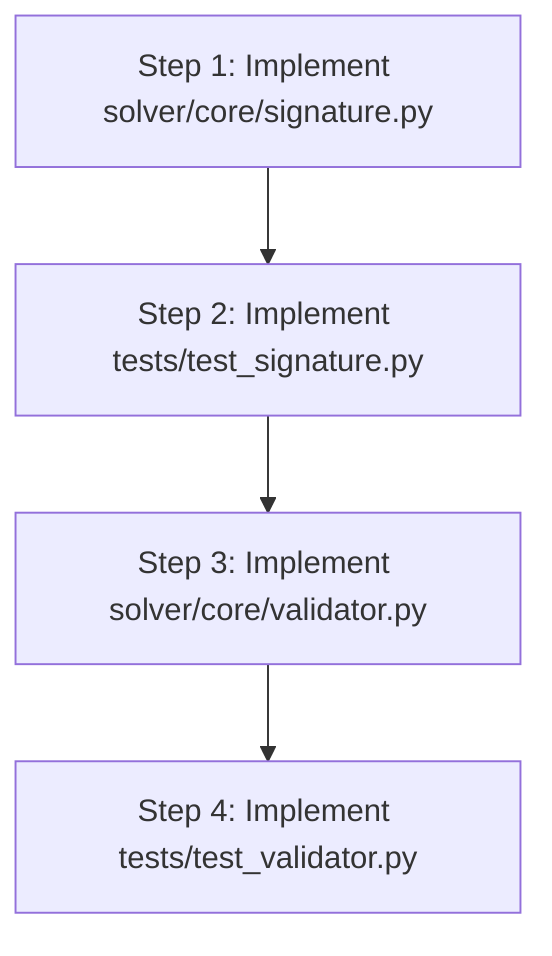

# Implementation Plan — Phase 2: Signature & Validator

## 1. Phase Title, Goal, and Overview

- **Phase Title**: Phase 2 — Symbol Signatures & Centralized AST Validator
- **Goal**: Provide robust symbol declaration management (`Signature`) and centralized AST well-formedness validation (`validator.py`) for First-Order Logic (FOL) with sorts.
- **Overview**:  
  In a multi-sorted logical system, terms and formulas must conform to strictly declared function, predicate, and constant signatures. Spreading validity checks across parsers, provers, and rewriters leads to subtle bugs and duplicated code. Phase 2 introduces:
  1. **Symbol Signatures** ([Signature](file:///C:/Users/franc/Programmazione/solver/solver/core/signature.py)): Central registry for function, predicate, constant, and sort constructor declarations with conflict detection and signature merging capabilities.
  2. **Centralized AST Validator** ([validator.py](file:///C:/Users/franc/Programmazione/solver/solver/core/validator.py)): Recursive validation framework that checks symbol registration, arity correctness, sort compatibility, duplicate variable binders, scoping rules, and quantifier well-formedness.

---

## 2. Prerequisites

Phase 2 depends directly on the core foundational data structures established in Phase 1:

- [solver/core/ast.py](file:///C:/Users/franc/Programmazione/solver/solver/core/ast.py): Core AST nodes (`Term`, `Variable`, `Constant`, `FunctionApp`, `Formula`, `PredicateApp`, `Equality`, `Not`, `And`, `Or`, `Implies`, `Iff`, `Forall`, `Exists`, `VariableKind`).
- [solver/core/sorts.py](file:///C:/Users/franc/Programmazione/solver/solver/core/sorts.py): Multi-domain sort system (`Sort`, `PrimitiveSort`, `ParameterizedSort`, `Ind`, `Nat`, `Bool`, `is_compatible`, `sort_of_term`).
- [solver/core/exceptions.py](file:///C:/Users/franc/Programmazione/solver/solver/core/exceptions.py): Common exception hierarchy (`SolverError`, `ValidationError`, `InvalidFormulaError`, `SortMismatchError`).

---

## 3. Files to Create / Modify

1. [solver/core/signature.py](file:///C:/Users/franc/Programmazione/solver/solver/core/signature.py) — Core symbol declaration registry and merge utilities.
2. [solver/core/validator.py](file:///C:/Users/franc/Programmazione/solver/solver/core/validator.py) — Centralized AST well-formedness and sort-checking engine.
3. [tests/test_signature.py](file:///C:/Users/franc/Programmazione/solver/tests/test_signature.py) — Unit tests for symbol registration, lookup, collisions, and signature merging.
4. [tests/test_validator.py](file:///C:/Users/franc/Programmazione/solver/tests/test_validator.py) — Unit tests for arity mismatches, sort errors, variable scoping, and quantifier validation.

---

## 4. Detailed Implementation Guide

### 4.1 `solver/core/signature.py`

Cross-references: Master Plan Sections 2.3, 3.3, 4, 6 (Phase 2).

#### Data Structures & Declarations

```python
from dataclasses import dataclass, field
from typing import Dict, Optional, Tuple, Set
from solver.core.sorts import Sort, Ind
from solver.core.exceptions import ValidationError

@dataclass(frozen=True)
class FunctionDecl:
    """Declaration of a function symbol in a logical signature.
    
    Attributes:
        name: Unique string name of the function.
        arity: Number of arguments expected (>= 0).
        arg_sorts: Tuple of expected argument sorts.
        return_sort: Sort of the returned term (defaults to Ind).
    """
    name: str
    arity: int
    arg_sorts: Tuple[Sort, ...]
    return_sort: Sort = Ind

    def __post_init__(self) -> None:
        if self.arity < 0:
            raise ValueError(f"Function arity cannot be negative: {self.arity}")
        if len(self.arg_sorts) != self.arity:
            raise ValueError(
                f"Function '{self.name}' arity {self.arity} does not match arg_sorts length {len(self.arg_sorts)}"
            )

@dataclass(frozen=True)
class PredicateDecl:
    """Declaration of a predicate symbol in a logical signature.
    
    Attributes:
        name: Unique string name of the predicate.
        arity: Number of arguments expected (>= 0).
        arg_sorts: Tuple of expected argument sorts.
    """
    name: str
    arity: int
    arg_sorts: Tuple[Sort, ...]

    def __post_init__(self) -> None:
        if self.arity < 0:
            raise ValueError(f"Predicate arity cannot be negative: {self.arity}")
        if len(self.arg_sorts) != self.arity:
            raise ValueError(
                f"Predicate '{self.name}' arity {self.arity} does not match arg_sorts length {len(self.arg_sorts)}"
            )
```

#### Class `Signature`

```python
class Signature:
    """Declares available functions, predicates, constants, and sort constructors in a logical context."""

    def __init__(
        self,
        functions: Optional[Dict[str, FunctionDecl]] = None,
        predicates: Optional[Dict[str, PredicateDecl]] = None,
        constants: Optional[Dict[str, Sort]] = None,
        sort_constructors: Optional[Dict[str, int]] = None,
    ) -> None:
        self.functions: Dict[str, FunctionDecl] = dict(functions) if functions else {}
        self.predicates: Dict[str, PredicateDecl] = dict(predicates) if predicates else {}
        self.constants: Dict[str, Sort] = dict(constants) if constants else {}
        self.sort_constructors: Dict[str, int] = dict(sort_constructors) if sort_constructors else {}

    def register_function(
        self,
        name: str,
        arity: int,
        arg_sorts: Tuple[Sort, ...],
        return_sort: Sort = Ind
    ) -> None:
        """Register a function symbol in the signature.
        
        Raises:
            ValidationError: If symbol name collides with another predicate/constant or incompatible function decl.
        """
        ...

    def register_predicate(
        self,
        name: str,
        arity: int,
        arg_sorts: Tuple[Sort, ...]
    ) -> None:
        """Register a predicate symbol in the signature.
        
        Raises:
            ValidationError: If symbol name collides with another function/constant or incompatible predicate decl.
        """
        ...

    def register_constant(self, name: str, sort: Sort = Ind) -> None:
        """Register a constant symbol in the signature.
        
        Raises:
            ValidationError: If symbol name collides with a function/predicate or incompatible constant declaration.
        """
        ...

    def register_sort_constructor(self, name: str, arity: int) -> None:
        """Register a parameterized sort constructor (e.g. Set -> 1, Pair -> 2)."""
        ...

    def lookup_function(self, name: str) -> Optional[FunctionDecl]:
        """Retrieve function declaration by name."""
        return self.functions.get(name)

    def lookup_predicate(self, name: str) -> Optional[PredicateDecl]:
        """Retrieve predicate declaration by name."""
        return self.predicates.get(name)

    def lookup_constant(self, name: str) -> Optional[Sort]:
        """Retrieve constant sort by name."""
        return self.constants.get(name)

    def lookup_sort_constructor(self, name: str) -> Optional[int]:
        """Retrieve sort constructor arity by name."""
        return self.sort_constructors.get(name)

    def has_symbol(self, name: str) -> bool:
        """Check if symbol name is declared as constant, function, or predicate."""
        return (name in self.functions) or (name in self.predicates) or (name in self.constants)

    def merge(self, other: "Signature") -> "Signature":
        """Merge two signatures into a new combined Signature.
        
        Raises:
            ValidationError: If there is a declaration conflict between the two signatures.
        """
        ...

    def clone(self) -> "Signature":
        """Create a deep copy of the signature."""
        return Signature(
            functions=dict(self.functions),
            predicates=dict(self.predicates),
            constants=dict(self.constants),
            sort_constructors=dict(self.sort_constructors),
        )

    @classmethod
    def empty(cls) -> "Signature":
        """Create an empty signature instance."""
        return cls()
```

#### Algorithms & Implementation Details for `signature.py`:

1. **Symbol Conflict Checks**:
   - Before adding to `self.functions[name]`, check whether `name` exists in `self.predicates` or `self.constants`. If so, raise `ValidationError(f"Symbol '{name}' is already declared as a predicate/constant")`.
   - If `name` is already in `self.functions`, verify that `existing_decl == new_decl`. Re-registering an identical declaration is idempotent; re-registering with different arity or sorts raises `ValidationError`.
   - Similar checks apply to `register_predicate` and `register_constant`.

2. **Signature Merging (`merge`)**:
   - Create a new `Signature` instance starting with copies of `self` entries.
   - For every entry in `other.functions`, call internal registration or check for equality. If `other` contains a conflicting symbol definition, accumulate error details and raise `ValidationError`.
   - Perform the same validation for `predicates`, `constants`, and `sort_constructors`.

---

### 4.2 `solver/core/validator.py`

Cross-references: Master Plan Sections 2.2, 2.3, 3.4, 4, 6 (Phase 2).

#### Validation Functions & Signatures

```python
from typing import List, Set, Union, Optional
from solver.core.ast import (
    Term, Formula, Variable, Constant, FunctionApp,
    PredicateApp, Equality, Not, And, Or, Implies, Iff,
    Forall, Exists, VariableKind
)
from solver.core.sorts import Sort, is_compatible, sort_of_term
from solver.core.signature import Signature
from solver.core.exceptions import ValidationError

def validate_term(
    term: Term,
    signature: Signature,
    scope: Optional[Set[Variable]] = None
) -> List[ValidationError]:
    """Validate a term AST node for symbol registration, arity, and sort correctness.
    
    Args:
        term: The term node to validate.
        signature: The logical signature context.
        scope: Set of currently bound variables in outer scopes.
        
    Returns:
        A list of validation errors found in the term (empty if well-formed).
    """
    ...

def validate_formula(
    formula: Formula,
    signature: Signature,
    scope: Optional[Set[Variable]] = None
) -> List[ValidationError]:
    """Validate a formula AST node for arity, sorts, binder scoping, and quantifier well-formedness.
    
    Args:
        formula: The formula node to validate.
        signature: The logical signature context.
        scope: Set of currently bound variables in outer scopes.
        
    Returns:
        A list of validation errors found in the formula (empty if well-formed).
    """
    ...

def is_well_formed(node: Union[Term, Formula], signature: Signature) -> bool:
    """Convenience wrapper returning True if the AST node has zero validation errors."""
    if isinstance(node, Term):
        return len(validate_term(node, signature)) == 0
    elif isinstance(node, Formula):
        return len(validate_formula(node, signature)) == 0
    else:
        return False
```

#### Detailed Validation Rules & Algorithms:

1. **Term Validation (`validate_term`)**:
   - **[Variable](file:///C:/Users/franc/Programmazione/solver/solver/core/ast.py)**:
     - Check variable kind: Must be `VariableKind.INDIVIDUAL` for First-Order Logic. (Function/Predicate variables emit `ValidationError` in FOL mode).
     - Index check: `var.id >= 0`.
   - **[Constant](file:///C:/Users/franc/Programmazione/solver/solver/core/ast.py)**:
     - Look up `decl_sort = signature.lookup_constant(const.name)`.
     - If `decl_sort is None`: emit `ValidationError(f"Unregistered constant symbol '{const.name}'")`.
     - If `decl_sort` exists: verify `is_compatible(const.sort, decl_sort)`. If incompatible, emit `ValidationError(f"Constant '{const.name}' sort {const.sort} incompatible with registered sort {decl_sort}")`.
   - **[FunctionApp](file:///C:/Users/franc/Programmazione/solver/solver/core/ast.py)**:
     - Look up `decl = signature.lookup_function(func.func)`.
     - If `decl is None`: emit `ValidationError(f"Unregistered function symbol '{func.func}'")`.
     - If `decl` exists:
       - Arity check: Check `func.arity == decl.arity` and `len(func.args) == decl.arity`. Emit error on mismatch.
       - Return sort check: `is_compatible(func.return_sort, decl.return_sort)`.
       - Argument sort checks: For each argument $t_i \in \text{args}$ with index $i$:
         - Recursively run `validate_term(t_i, signature, scope)`.
         - Infer argument sort $s_i = \text{sort\_of\_term}(t_i, \text{signature})$.
         - Verify `is_compatible(s_i, decl.arg_sorts[i])`. Emit sort mismatch error if incompatible.

2. **Formula Validation (`validate_formula`)**:
   - **[PredicateApp](file:///C:/Users/franc/Programmazione/solver/solver/core/ast.py)**:
     - Look up `decl = signature.lookup_predicate(pred.pred)`.
     - If `decl is None`: emit `ValidationError(f"Unregistered predicate symbol '{pred.pred}'")`.
     - If `decl` exists:
       - Arity check: `pred.arity == decl.arity` and `len(pred.args) == decl.arity`.
       - Argument sort checks: For each $t_i$, validate sub-term and verify `is_compatible(sort_of_term(t_i, signature), decl.arg_sorts[i])`.
   - **[Equality](file:///C:/Users/franc/Programmazione/solver/solver/core/ast.py)**:
     - Recursively run `validate_term(eq.left, signature, scope)` and `validate_term(eq.right, signature, scope)`.
     - Infer sorts $s_L = \text{sort\_of\_term}(\text{eq.left}, \text{signature})$ and $s_R = \text{sort\_of\_term}(\text{eq.right}, \text{signature})$.
     - Verify `is_compatible(s_L, s_R)`. If incompatible, emit `ValidationError(f"Equality sort mismatch: left sort {s_L} vs right sort {s_R}")`.
   - **[Not](file:///C:/Users/franc/Programmazione/solver/solver/core/ast.py)**:
     - Recursively validate `operand`.
   - **[And](file:///C:/Users/franc/Programmazione/solver/solver/core/ast.py) / [Or](file:///C:/Users/franc/Programmazione/solver/solver/core/ast.py) / [Implies](file:///C:/Users/franc/Programmazione/solver/solver/core/ast.py) / [Iff](file:///C:/Users/franc/Programmazione/solver/solver/core/ast.py)**:
     - Recursively validate `left` and `right`.
   - **[Forall](file:///C:/Users/franc/Programmazione/solver/solver/core/ast.py) / [Exists](file:///C:/Users/franc/Programmazione/solver/solver/core/ast.py)**:
     - Binder variable check: `var = node.variable`. Verify `var.kind == VariableKind.INDIVIDUAL`.
     - Scoping & Duplicate Binder Check:
       - Initialize `scope_set = set(scope) if scope else set()`.
       - Check if `var` (by equality or variable ID/sort combination) is already present in `scope_set`. If `var in scope_set`, emit `ValidationError(f"Duplicate binder in scope: variable {var.id}")`.
       - Create updated scope `new_scope = scope_set | {var}`.
       - Recursively validate `node.body` using `new_scope`.

---

## 5. Step-by-Step Implementation Order



### Detailed Step Rationale:

1. **Step 1: `solver/core/signature.py`**  
   Implement `FunctionDecl`, `PredicateDecl`, and `Signature` with full validation methods (`register_*`, `lookup_*`, `merge`, `clone`).  
   *Why first?* `validator.py` depends directly on `Signature` for looking up declared symbols and arities.

2. **Step 2: `tests/test_signature.py`**  
   Write comprehensive unit tests targeting `Signature` registration, duplicate collision checks, lookup methods, and signature merging.  
   *Why second?* Ensures symbol registry behaves deterministically before building the AST validation layer on top.

3. **Step 3: `solver/core/validator.py`**  
   Implement `validate_term`, `validate_formula`, and `is_well_formed`. Wire up recursive traversals for all term and formula AST node types.  
   *Why third?* Requires both Phase 1 AST/Sort definitions and Phase 2 `Signature`.

4. **Step 4: `tests/test_validator.py`**  
   Write thorough unit tests covering valid formulas, arity errors, sort mismatches, unregistered symbols, duplicate binders, and nested quantifier structures.  
   *Why fourth?* Validates end-to-end correctness of the validation layer against expected acceptance criteria.

---

## 6. Testing Requirements

### 6.1 Test Suite Breakdown

#### `tests/test_signature.py`
- **Registration & Retrieval**:
  - Register function `f(Nat) -> Nat`, verify `lookup_function("f")` returns `FunctionDecl`.
  - Register predicate `P(Nat, Bool)`, verify `lookup_predicate("P")` returns `PredicateDecl`.
  - Register constant `c: Nat`, verify `lookup_constant("c")` returns `Nat`.
  - Register sort constructor `Set: 1`, verify `lookup_sort_constructor("Set")` returns `1`.
  - Lookup non-existent symbol returns `None`.
- **Conflict Prevention**:
  - Registering symbol `foo` as function then as predicate raises `ValidationError`.
  - Registering function `f` with arity 1 then re-registering `f` with arity 2 raises `ValidationError`.
- **Signature Merging**:
  - Merge two disjoint signatures -> combined signature containing all symbols.
  - Merge signatures with identical symbol declarations -> succeeds idempotently.
  - Merge signatures with conflicting symbol declarations -> raises `ValidationError`.

#### `tests/test_validator.py`
- **Arity Validation**:
  - Valid `FunctionApp("f", 2, [t1, t2])` -> 0 errors.
  - `FunctionApp("f", 1, [t1, t2])` with declared arity 2 -> `ValidationError` (arity mismatch).
  - `PredicateApp("P", 1, [t1])` with declared arity 2 -> `ValidationError` (arity mismatch).
- **Sort Validation**:
  - `FunctionApp("f", 1, [Constant("c", Bool)])` where `f` expects `Nat` -> `ValidationError` (sort mismatch).
  - `Equality(Constant("c1", Nat), Constant("c2", Bool))` -> `ValidationError` (equality sort mismatch).
  - Parameterized sort matching (e.g. `Set(Nat)` vs `Set(Bool)`) -> `ValidationError`.
  - Generic individual sort `Ind` compatibility -> 0 errors when `Ind` is accepted supertype.
- **Unregistered Symbols**:
  - Unregistered function, predicate, or constant -> `ValidationError`.
- **Quantifier & Scoping Validation**:
  - Nested quantifiers with distinct variables `Forall(v0, Forall(v1, P(v0, v1)))` -> 0 errors.
  - Shadowed/duplicate binder `Forall(v0, Forall(v0, P(v0)))` -> `ValidationError` (duplicate binder).
  - SOL variable kind in FOL validator -> `ValidationError`.
- **Convenience Wrapper**:
  - `is_well_formed()` returns `True` for valid nodes and `False` when `validate_*` returns errors.

---

## 7. Acceptance Criteria

1. **Symbol Declaration Integrity**:
   - `Signature` successfully registers and retrieves functions, predicates, constants, and sort constructors.
   - Symbol name collisions across symbol types raise `ValidationError`.
   - `merge()` correctly combines valid signatures and detects declaration mismatches.

2. **AST Well-Formedness Checking**:
   - `validate_formula()` and `validate_term()` catch all arity mismatches, sort errors, unregistered symbols, and duplicate binders.
   - Valid AST structures produce empty error lists.
   - `is_well_formed()` accurately reflects the error list status as a boolean.

3. **Test Suite Verification**:
   - Running `pytest tests/test_signature.py tests/test_validator.py` executes without failures or warnings and achieves high code coverage.

---

## 8. Risks and Mitigations

| Risk | Impact | Mitigation Strategy |
|:---|:---|:---|
| **Circular Imports** between `sorts.py`, `signature.py`, and `validator.py` | Import failure at runtime | Enforce strict one-way import hierarchy: `exceptions` -> `sorts` -> `ast` -> `signature` -> `validator`. Use type annotations with string references (`"Signature"`) where necessary. |
| **Cascading Error Explosion** (one bad sub-term producing redundant errors at parent nodes) | Confusing error messages | Collect sub-term errors cleanly without duplicating parent messages, and include detailed structural paths/context in `ValidationError`. |
| **Loose Sort Matching** bypassing valid sort constraints | Unsound logic derivations | Enforce `is_compatible()` checks strictly on every function/predicate argument and equality term pair. |
