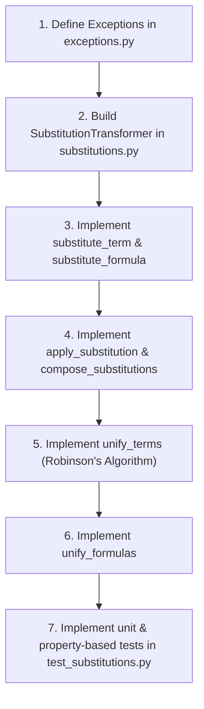

# Phase 4 — Substitution & Unification Implementation Plan

**Goal**: Implement First-Order Logic (FOL) substitution with capture avoidance, Robinson's first-order unification algorithm with occur-check and sort-checking, and substitution composition.

**Deliverables**:
- [solver/core/substitutions.py](file:///C:/Users/franc/Programmazione/solver/solver/core/substitutions.py)
- [tests/test_substitutions.py](file:///C:/Users/franc/Programmazione/solver/tests/test_substitutions.py)

---

## 1. Overview & Architectural Goals

Phase 4 introduces term and formula substitution, variable renaming, capture avoidance, substitution composition, and first-order term/formula unification. These algorithms form the syntactic backbone of the solver system, enabling formula instantiation, term rewriting (Phase 5), clause resolution in the theorem prover (Phase 7), and proof reconstruction.

### Scope Restriction
> [!IMPORTANT]  
> Unification in this module is **strictly first-order**. Robinson's algorithm operates on first-order terms and atomic predicates only. It does **NOT** handle predicate variables, function variables, or Second-Order Logic (SOL) expressions. Higher-order pattern unification is deferred to `solver/sol/substitutions_ext.py` in Phase 11.

---

## 2. Prerequisites

The following modules and features must be implemented and passing tests prior to starting Phase 4:

1. **Phase 1 — AST & Sort System**:
   - `solver/core/ast.py`: Immutable AST nodes (`Term`, `Variable`, `Constant`, `FunctionApp`, `Formula`, `PredicateApp`, `Equality`, `Not`, `And`, `Or`, `Implies`, `Iff`, `Forall`, `Exists`), `free_variables(node)`, `bound_variables(node)`.
   - `solver/core/sorts.py`: `Sort` hierarchy, `is_compatible(s1, s2)`, `sort_of_term(term, signature)`.
2. **Phase 2 — Signature & Validator**:
   - `solver/core/signature.py`: `Signature` management.
   - `solver/core/validator.py`: Well-formedness checks.
3. **Phase 3 — Visitor Framework**:
   - `solver/core/visitors.py`: `ASTVisitor[T]`, `ASTTransformer`.
4. **Exception Subsystem**:
   - `solver/core/exceptions.py`: `UnificationError`, `SortMismatchError`, `SolverError`.

---

## 3. Files to Create / Modify

| File Path | Action | Description |
|:---|:---|:---|
| `solver/core/substitutions.py` | Create | Implements `substitute_term`, `substitute_formula`, `apply_substitution`, `compose_substitutions`, `unify_terms`, `unify_formulas`, and `SubstitutionTransformer`. |
| `tests/test_substitutions.py` | Create | Unit tests and Hypothesis property-based tests for substitution, capture avoidance, composition, and unification invariants. |

---

## 4. Detailed Module Specifications

### 4.1 `solver/core/substitutions.py`

This module provides substitution, capture avoidance, composition, and first-order Robinson unification.

#### 4.1.1 Helper Class: `SubstitutionTransformer`

`SubstitutionTransformer` extends `ASTTransformer` (from `solver/core/visitors.py`) to recursively apply variable substitutions while respecting quantifier scopes and avoiding variable capture.

```python
from typing import Dict, Set, Optional, Union, Callable
from solver.core.ast import (
    Term, Variable, Constant, FunctionApp, Formula, PredicateApp,
    Equality, Not, And, Or, Implies, Iff, Forall, Exists,
    free_variables, bound_variables
)
from solver.core.sorts import Sort, is_compatible, sort_of_term
from solver.core.visitors import ASTTransformer
from solver.core.exceptions import UnificationError, SortMismatchError

class SubstitutionTransformer(ASTTransformer):
    """
    AST transformer for capture-avoiding variable substitution.
    """
    mapping: Dict[Variable, Term]
    scope_bound_vars: Set[Variable]

    def __init__(self, mapping: Dict[Variable, Term]) -> None:
        super().__init__()
        self.mapping = dict(mapping)
        self.scope_bound_vars = set()

    def visit_variable(self, node: Variable) -> Term:
        if node in self.mapping:
            return self.mapping[node]
        return node

    def visit_constant(self, node: Constant) -> Term:
        return node

    def visit_function_app(self, node: FunctionApp) -> FunctionApp:
        new_args = tuple(self.visit(arg) for arg in node.args)
        return FunctionApp(
            func=node.func,
            arity=node.arity,
            args=new_args,
            return_sort=node.return_sort
        )

    def visit_predicate_app(self, node: PredicateApp) -> PredicateApp:
        new_args = tuple(self.visit(arg) for arg in node.args)
        return PredicateApp(
            pred=node.pred,
            arity=node.arity,
            args=new_args
        )

    def visit_equality(self, node: Equality) -> Equality:
        new_left = self.visit(node.left)
        new_right = self.visit(node.right)
        return Equality(left=new_left, right=new_right)

    def visit_forall(self, node: Forall) -> Forall:
        return self._handle_quantifier(node.variable, node.body, Forall)

    def visit_exists(self, node: Exists) -> Exists:
        return self._handle_quantifier(node.variable, node.body, Exists)

    def _handle_quantifier(
        self,
        bound_var: Variable,
        body: Formula,
        constructor: Callable[[Variable, Formula], Formula]
    ) -> Formula:
        # 1. Shadowing: remove bound_var from active mapping for inner scope
        old_mapping_val = self.mapping.pop(bound_var, None)
        
        # 2. Check if bound_var would capture any free variable in replacement terms
        # Collect free variables of all replacement terms for variables free in body
        body_free_vars = free_variables(body)
        relevant_replacements = [
            self.mapping[var] for var in body_free_vars if var in self.mapping
        ]
        replacement_free_vars: Set[Variable] = set()
        for repl in relevant_replacements:
            replacement_free_vars.update(free_variables(repl))

        # Capture occurs if bound_var is in replacement_free_vars
        if bound_var in replacement_free_vars:
            # 3. Generate a fresh variable that doesn't conflict
            fresh_var = self._generate_fresh_variable(
                base_var=bound_var,
                forbidden=body_free_vars | replacement_free_vars | bound_variables(body) | self.scope_bound_vars
            )
            # Rename bound_var to fresh_var in body before substitution
            body = self._rename_bound_variable(body, bound_var, fresh_var)
            target_var = fresh_var
        else:
            target_var = bound_var

        # 4. Process body recursively
        self.scope_bound_vars.add(target_var)
        new_body = self.visit(body)
        self.scope_bound_vars.remove(target_var)

        # Restore shadowed mapping entry
        if old_mapping_val is not None:
            self.mapping[bound_var] = old_mapping_val

        return constructor(target_var, new_body)

    def _generate_fresh_variable(self, base_var: Variable, forbidden: Set[Variable]) -> Variable:
        forbidden_ids = {v.id for v in forbidden}
        new_id = base_var.id
        while new_id in forbidden_ids:
            new_id += 1
        return Variable(id=new_id, sort=base_var.sort, kind=base_var.kind)

    def _rename_bound_variable(self, formula: Formula, old_var: Variable, new_var: Variable) -> Formula:
        # Internal alpha-renaming helper for capture avoidance
        renamer = SubstitutionTransformer({old_var: new_var})
        return renamer.visit(formula)
```

#### 4.1.2 Capture Avoidance Algorithm & Strategy

When substituting terms for free variables inside quantifiers (e.g., substituting $x \mapsto y$ inside $\forall y, P(x, y)$), naive replacement captures $y$ under $\forall y$, yielding $\forall y, P(y, y)$, which changes formula semantics.

**Capture Avoidance Rules**:
1. **Sort Validation**: Before applying substitution, every mapping entry $(v \mapsto t)$ is checked: `is_compatible(v.sort, sort_of_term(t))` must hold. If not, raise `SortMismatchError`.
2. **Quantifier Shadowing**: When traversing into $\forall v$ or $\exists v$, any mapping for $v$ is temporarily removed because occurrences of $v$ within the scope are bound and shadowed.
3. **Capture Detection**: A variable capture occurs if $v$ appears in `free_variables(t)` for any $x \mapsto t$ where $x \in \text{free\_variables}(body)$.
4. **Alpha-Renaming**: If capture is detected:
   - Generate a fresh variable $v_{\text{fresh}}$ of the same sort with an unused integer `id`.
   - Rename $v$ to $v_{\text{fresh}}$ in $body$.
   - Substitute the updated $body$ under the binder $v_{\text{fresh}}$.

---

#### 4.1.3 Standalone Functions & Signatures

##### 1. `substitute_term`
```python
def substitute_term(term: Term, mapping: Dict[Variable, Term]) -> Term:
    """
    Replaces variables in a term according to mapping.
    
    Args:
        term: Target Term AST node.
        mapping: Dictionary mapping variables to replacement terms.
        
    Returns:
        New Term node with variables substituted.
        
    Raises:
        SortMismatchError: If any mapped term sort is incompatible with variable sort.
    """
```
*Implementation details*: Validate sorts of `mapping`. If `mapping` is empty, return `term`. Otherwise, instantiate `SubstitutionTransformer(mapping)` and invoke `visit(term)`.

##### 2. `substitute_formula`
```python
def substitute_formula(formula: Formula, mapping: Dict[Variable, Term]) -> Formula:
    """
    Replaces free variables in a formula while preventing variable capture.
    
    Args:
        formula: Target Formula AST node.
        mapping: Dictionary mapping free variables to replacement terms.
        
    Returns:
        New Formula node with capture-avoiding substitution applied.
        
    Raises:
        SortMismatchError: If any mapped term sort is incompatible with variable sort.
    """
```
*Implementation details*: Validate sorts of `mapping`. If `mapping` is empty, return `formula`. Otherwise, run `SubstitutionTransformer(mapping).visit(formula)`.

##### 3. `apply_substitution`
```python
def apply_substitution(subst: Dict[Variable, Term], term: Term) -> Term:
    """
    Applies a substitution mapping to a term (idempotent helper wrapper).
    
    Args:
        subst: Substitution dictionary.
        term: Target term.
        
    Returns:
        Substituted term.
    """
    return substitute_term(term, subst)
```

##### 4. `compose_substitutions`
```python
def compose_substitutions(
    s1: Dict[Variable, Term],
    s2: Dict[Variable, Term]
) -> Dict[Variable, Term]:
    """
    Composes two substitutions s1 and s2 such that:
    apply_substitution(compose_substitutions(s1, s2), t) == apply_substitution(s1, apply_substitution(s2, t))
    
    Mathematical Definition: (s1 o s2)(x) = s1(s2(x))
    
    Args:
        s1: First substitution applied (outer substitution).
        s2: Second substitution applied (inner substitution).
        
    Returns:
        Composed substitution dictionary.
    """
```
*Composition Algorithm*:
1. Initialize `result = {}`.
2. For each $(x \mapsto t_x)$ in $s_2$:
   - Compute $t_x' = \text{substitute\_term}(t_x, s_1)$.
   - If $x \neq t_x'$ (omit trivial identity mappings): `result[x] = t_x'`.
3. For each $(y \mapsto t_y)$ in $s_1$:
   - If $y \notin s_2$: `result[y] = t_y`.
4. Return `result`.

##### 5. `unify_terms`
```python
def unify_terms(
    t1: Term,
    t2: Term,
    subst: Optional[Dict[Variable, Term]] = None
) -> Dict[Variable, Term]:
    """
    Implements Robinson's unification algorithm on first-order terms with occur-check
    and sort compatibility checking.
    
    Args:
        t1: First term.
        t2: Second term.
        subst: Accumulated substitution context (optional).
        
    Returns:
        Most General Unifier (MGU) as a dictionary mapping variables to terms.
        
    Raises:
        UnificationError: If terms cannot be unified (e.g. constant mismatch, arity mismatch, occur-check failure).
        SortMismatchError: If term sorts are incompatible during variable binding.
    """
```
*Robinson's Algorithm Flow*:
```python
if subst is None:
    subst = {}
else:
    subst = dict(subst)

# Helper: Dereference terms through accumulated subst
def deref(t: Term, s: Dict[Variable, Term]) -> Term:
    while isinstance(t, Variable) and t in s:
        t = s[t]
    return t

t1 = deref(t1, subst)
t2 = deref(t2, subst)

if t1 == t2:
    return subst

if isinstance(t1, Variable):
    # Occur-check
    if t1 in free_variables(t2):
        raise UnificationError(f"Occur-check failed: variable {t1} occurs in {t2}")
    # Sort check
    t2_sort = sort_of_term(t2)
    if not is_compatible(t1.sort, t2_sort):
        raise SortMismatchError(f"Sort mismatch unifying {t1} ({t1.sort}) with {t2} ({t2_sort})")
    # Bind variable
    subst[t1] = t2
    # Apply new binding transitively to existing subst values
    for v, val in list(subst.items()):
        if v != t1:
            subst[v] = substitute_term(val, {t1: t2})
    return subst

if isinstance(t2, Variable):
    return unify_terms(t2, t1, subst)

if isinstance(t1, Constant) and isinstance(t2, Constant):
    if t1.name == t2.name and is_compatible(t1.sort, t2.sort):
        return subst
    raise UnificationError(f"Constant mismatch: '{t1.name}' vs '{t2.name}'")

if isinstance(t1, FunctionApp) and isinstance(t2, FunctionApp):
    if t1.func != t2.func or t1.arity != t2.arity:
        raise UnificationError(f"Function symbol/arity mismatch: '{t1.func}/{t1.arity}' vs '{t2.func}/{t2.arity}'")
    if not is_compatible(t1.return_sort, t2.return_sort):
        raise SortMismatchError(f"Return sort mismatch in function unification: {t1.return_sort} vs {t2.return_sort}")
    curr_subst = subst
    for a1, a2 in zip(t1.args, t2.args):
        curr_subst = unify_terms(a1, a2, curr_subst)
    return curr_subst

raise UnificationError(f"Cannot unify incompatible term structures: {type(t1).__name__} and {type(t2).__name__}")
```

##### 6. `unify_formulas`
```python
def unify_formulas(f1: Formula, f2: Formula) -> Dict[Variable, Term]:
    """
    Unifies atomic predicate expressions (first-order only).
    
    Args:
        f1: First atomic formula (PredicateApp or Equality).
        f2: Second atomic formula (PredicateApp or Equality).
        
    Returns:
        MGU substitution dictionary.
        
    Raises:
        UnificationError: If formulas are non-atomic or predicates/arities mismatch.
    """
```
*Implementation details*:
- If `f1` and `f2` are `PredicateApp`:
  - Verify `f1.pred == f2.pred` and `f1.arity == f2.arity`. If not, raise `UnificationError`.
  - Sequentially unify arguments:
    ```python
    curr_subst = {}
    for a1, a2 in zip(f1.args, f2.args):
        curr_subst = unify_terms(a1, a2, curr_subst)
    return curr_subst
    ```
- If `f1` and `f2` are `Equality`:
  - Unify `f1.left` with `f2.left`, then `f1.right` with `f2.right`.
- If `f1` or `f2` are non-atomic formulas (`Not`, `And`, `Or`, `Implies`, `Iff`, `Forall`, `Exists`):
  - Raise `UnificationError("Unification is strictly restricted to first-order atomic formulas.")`.

---

## 5. Step-by-Step Implementation Order



1. **Step 1: Check Exceptions**: Verify `UnificationError` and `SortMismatchError` are available in `solver/core/exceptions.py`.
2. **Step 2: Implement Transformer & Basic Substitution**: Build `SubstitutionTransformer`, handle variable mapping, constant passthrough, and function/predicate application.
3. **Step 3: Implement Capture Avoidance**: Add quantifier variable shadowing and fresh variable generation in `_handle_quantifier`. Expose `substitute_term` and `substitute_formula`.
4. **Step 4: Implement Substitution Composition**: Add `compose_substitutions` and `apply_substitution`.
5. **Step 5: Implement Term Unification**: Implement `unify_terms` with variable dereferencing, occur-check, and sort checking.
6. **Step 6: Implement Formula Unification**: Implement `unify_formulas` for atomic formulas (`PredicateApp` and `Equality`).
7. **Step 7: Testing & Verification**: Create `tests/test_substitutions.py`, write unit tests and Hypothesis property-based tests, execute `pytest`.

---

## 6. Testing Strategy & Requirements

### 6.1 Requirements & Tools
- **Test File**: `tests/test_substitutions.py`
- **Framework**: `pytest`, `pytest-cov`
- **Property-based framework**: `hypothesis` (using strategy generators for AST terms and formulas).

### 6.2 Key Invariants to Verify

| Invariant | Test Type | Description |
|:---|:---|:---|
| **Capture Avoidance** | Property-Based | Substitution never captures bound variables in quantifiers |
| **Substitution Composition** | Property-Based | `apply(compose(s1, s2), t) == apply(s1, apply(s2, t))` |
| **Unification Commutativity** | Property-Based | `unify_terms(a, b)` succeeds iff `unify_terms(b, a)` succeeds |
| **Unification Idempotency** | Property-Based | `apply(unify(a, b), a) == apply(unify(a, b), b)` |
| **Occur-Check Prevention** | Unit | `unify_terms(x, f(x))` raises `UnificationError` |
| **Sort Rejection** | Unit | Unifying terms with incompatible sorts raises `SortMismatchError` |
| **Atomic Formula Unification** | Unit | Unifying `P(x, c)` and `P(a, y)` returns `{x: a, y: c}` |
| **Non-Atomic Unification Failure** | Unit | Unifying compound formulas raises `UnificationError` |

### 6.3 Test Suite Structure (`tests/test_substitutions.py`)

```python
import pytest
from hypothesis import given, strategies as st
from solver.core.ast import Variable, Constant, FunctionApp, PredicateApp, Forall, Exists, Equality
from solver.core.sorts import Ind, Nat, Bool
from solver.core.exceptions import UnificationError, SortMismatchError
from solver.core.substitutions import (
    substitute_term, substitute_formula, apply_substitution,
    compose_substitutions, unify_terms, unify_formulas
)

# 1. Unit Tests for Term & Formula Substitution
def test_substitute_term_simple():
    x = Variable(1, Ind)
    c = Constant("c", Ind)
    t = FunctionApp("f", 1, (x,), Ind)
    res = substitute_term(t, {x: c})
    assert res == FunctionApp("f", 1, (c,), Ind)

def test_substitute_formula_capture_avoidance():
    x = Variable(1, Ind)
    y = Variable(2, Ind)
    # substitute x -> y in Forall(y, P(x, y))
    body = PredicateApp("P", 2, (x, y))
    formula = Forall(y, body)
    res = substitute_formula(formula, {x: y})
    # y must be renamed to avoid capturing y from substitution
    assert isinstance(res, Forall)
    assert res.variable != y  # Alpha-renamed to fresh var (e.g. v3)
    assert res.variable not in (x, y)

def test_substitute_sort_mismatch():
    x = Variable(1, Nat)
    c = Constant("c", Bool)
    with pytest.raises(SortMismatchError):
        substitute_term(x, {x: c})

# 2. Composition Tests
def test_compose_substitutions_basic():
    x = Variable(1, Ind)
    y = Variable(2, Ind)
    a = Constant("a", Ind)
    s1 = {y: a}
    s2 = {x: y}
    composed = compose_substitutions(s1, s2)
    assert apply_substitution(composed, x) == a
    assert apply_substitution(composed, x) == apply_substitution(s1, apply_substitution(s2, x))

# 3. Unification Tests
def test_unify_terms_identical():
    x = Variable(1, Ind)
    subst = unify_terms(x, x)
    assert subst == {}

def test_unify_terms_variable_term():
    x = Variable(1, Ind)
    c = Constant("c", Ind)
    subst = unify_terms(x, c)
    assert subst == {x: c}

def test_unify_terms_occur_check():
    x = Variable(1, Ind)
    fx = FunctionApp("f", 1, (x,), Ind)
    with pytest.raises(UnificationError, match="Occur-check failed"):
        unify_terms(x, fx)

def test_unify_terms_sort_mismatch():
    x = Variable(1, Nat)
    c = Constant("c", Bool)
    with pytest.raises(SortMismatchError):
        unify_terms(x, c)

def test_unify_formulas_atomic():
    x = Variable(1, Ind)
    y = Variable(2, Ind)
    a = Constant("a", Ind)
    b = Constant("b", Ind)
    f1 = PredicateApp("P", 2, (x, b))
    f2 = PredicateApp("P", 2, (a, y))
    subst = unify_formulas(f1, f2)
    assert subst == {x: a, y: b}

def test_unify_formulas_non_atomic_raises():
    x = Variable(1, Ind)
    f1 = Forall(x, PredicateApp("P", 1, (x,)))
    with pytest.raises(UnificationError):
        unify_formulas(f1, f1)
```

---

## 7. Acceptance Criteria

Phase 4 will be marked complete when all of the following criteria are met:

1. **Complete Implementation**:
   - `solver/core/substitutions.py` is fully implemented with type hints on all public signatures.
   - All 6 core functions (`substitute_term`, `substitute_formula`, `apply_substitution`, `compose_substitutions`, `unify_terms`, `unify_formulas`) pass specifications.
2. **Capture Avoidance Verification**:
   - `substitute_formula` strictly prevents bound variable capture using fresh variable generation and alpha-renaming.
3. **Robinson Unification Correctness**:
   - `unify_terms` implements occur-check, correctly detecting infinite cyclic terms (e.g. $x \mapsto f(x)$).
   - Sort compatibility is enforced; sort mismatches raise `SortMismatchError`.
4. **Substitution Composition Correctness**:
   - `compose_substitutions(s1, s2)` preserves the invariant: `apply(compose(s1, s2), t) == apply(s1, apply(s2, t))`.
5. **Test Coverage & Passing Suite**:
   - `tests/test_substitutions.py` achieves 100% statement coverage on `solver/core/substitutions.py`.
   - All pytest unit and Hypothesis property-based tests pass cleanly without errors.

---

## 8. Risks and Mitigations

| Potential Risk | Severity | Mitigation Strategy |
|:---|:---|:---|
| **Infinite recursion in unification** | High | Implement strict occur-check in `unify_terms` before adding variable bindings to substitution dictionary. |
| **Accidental variable capture in nested quantifiers** | High | Collect all replacement term free variables and verify bound variables do not intersect; trigger fresh variable generation when non-empty. |
| **Invalid composition ordering** | Medium | Maintain standard composition semantics $(s_1 \circ s_2)(x) = s_1(s_2(x))$ where inner substitution $s_2$ is applied first, followed by outer substitution $s_1$. Verify with property-based testing. |
| **Sort mismatch leaks into prover** | Medium | Check `is_compatible` at every variable assignment in `unify_terms` and substitution initialization. |
