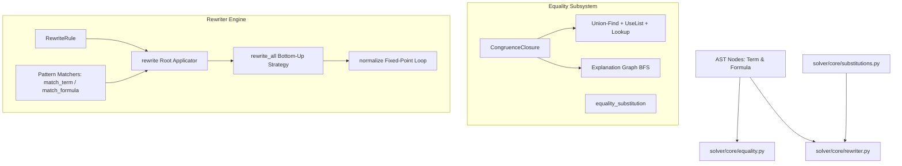
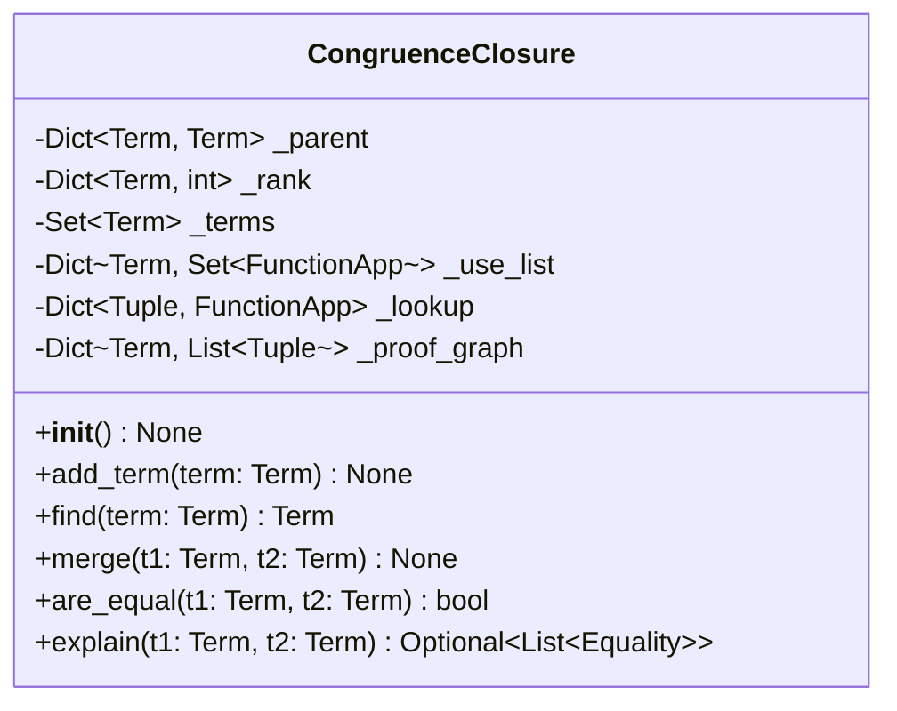
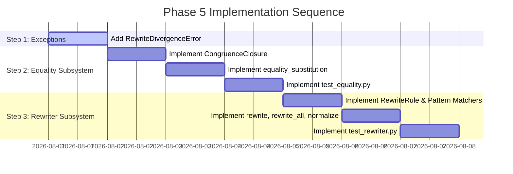

# Phase 5 — Equality & Rewriting Implementation Plan

**Goal**: Establish an equality reasoning subsystem based on congruence closure and a term and formula rewriting engine capable of normalizing logical expressions to canonical forms.

**Master Plan References**: Section 3.9 ([solver/core/equality.py](file:///C:/Users/franc/Programmazione/solver/solver/core/equality.py)), Section 3.10 ([solver/core/rewriter.py](file:///C:/Users/franc/Programmazione/solver/solver/core/rewriter.py)), Section 6 Phase 5.

---

## 1. Overview & Architecture

Equality reasoning is a foundational capability for automated reasoning and interactive logic systems. Naive recursive variable substitution is inefficient and fails to deduce congruence relationships (e.g., inferring $f(a) = f(b)$ from $a = b$) without explicit congruence rules. 

Phase 5 addresses these limitations by introducing two decoupled, highly specialized modules:

1. **Congruence Closure Subsystem (`solver/core/equality.py`)**: Implements an efficient Union-Find data structure augmented with term graph lookup tables to automatically propagate equalities through function applications ($a = b \implies f(a) = f(b)$) and construct explicit explanation paths for inferred equalities. Additionally provides all-position equality substitution helpers.
2. **Term & Formula Rewriting Engine (`solver/core/rewriter.py`)**: Implements single-direction pattern matching, conditional rewrite rules ($C \implies l \to r$), bottom-up inner-most fixed-point rewriting, and bounded normalization to transform terms and formulas into canonical simplifications.



---

## 2. Prerequisites & Dependencies

Phase 5 depends directly on the core abstract syntax tree, sort system, exception hierarchy, and substitution module established in earlier phases:

- **Phase 1**: [solver/core/ast.py](file:///C:/Users/franc/Programmazione/solver/solver/core/ast.py) (`Term`, `Formula`, `Variable`, `Constant`, `FunctionApp`, `Equality`, `Not`, `And`, `Or`, `Implies`, `Iff`, `Forall`, `Exists`)
- **Phase 1**: [solver/core/sorts.py](file:///C:/Users/franc/Programmazione/solver/solver/core/sorts.py) (`Sort`, `is_compatible`)
- **Phase 1**: [solver/core/exceptions.py](file:///C:/Users/franc/Programmazione/solver/solver/core/exceptions.py) (`SolverError`, `ValidationError`)
- **Phase 4**: [solver/core/substitutions.py](file:///C:/Users/franc/Programmazione/solver/solver/core/substitutions.py) (`substitute_term`, `substitute_formula`)

---

## 3. Files to Create and Modify

| Action | File Path | Description |
| :--- | :--- | :--- |
| **Modify** | [solver/core/exceptions.py](file:///C:/Users/franc/Programmazione/solver/solver/core/exceptions.py) | Add `RewriteDivergenceError` exception class. |
| **Create** | [solver/core/equality.py](file:///C:/Users/franc/Programmazione/solver/solver/core/equality.py) | Congruence closure subsystem and equality substitution generator. |
| **Create** | [solver/core/rewriter.py](file:///C:/Users/franc/Programmazione/solver/solver/core/rewriter.py) | Term and formula rewrite rules, pattern matching, fixed-point rewriting, and normalization engine. |
| **Create** | [tests/test_equality.py](file:///C:/Users/franc/Programmazione/solver/tests/test_equality.py) | Unit and property-based tests for congruence closure, explanation chains, and equality substitutions. |
| **Create** | [tests/test_rewriter.py](file:///C:/Users/franc/Programmazione/solver/tests/test_rewriter.py) | Unit tests for pattern matching, single/multi-rule rewriting, bottom-up traversal, fixed points, and normalization bounds. |

---

## 4. Detailed Module Specifications

### 4.1 `solver/core/exceptions.py` (Additions)

Add the following exception to the exception hierarchy for handling non-terminating rewrite loops:

```python
class RewriteDivergenceError(SolverError):
    """Raised when formula normalization fails to reach a fixed point within max_steps."""
    pass
```

---

### 4.2 `solver/core/equality.py` (Section 3.9)

#### Data Structures & Algorithms

The `CongruenceClosure` class manages equivalence classes over terms using a modified Nelson-Oppen / Downey-Sethi-Tarjan congruence closure algorithm:

1. **Union-Find Forest**:
   - `_parent: Dict[Term, Term]`: Maps each term to its immediate parent in the disjoint-set tree.
   - `_rank: Dict[Term, int]`: Tracks tree height for union-by-rank balancing.
2. **Lookup Table**:
   - `_lookup: Dict[Tuple[str, Tuple[Term, ...]], FunctionApp]`: Maps a signature tuple `(func_name, (rep(arg_1), ..., rep(arg_k)))` to a canonical `FunctionApp` term registered in the graph. If two distinct `FunctionApp` instances evaluate to the same argument representatives, they hit the same lookup key and trigger automatic congruence merging.
3. **Use List**:
   - `_use_list: Dict[Term, Set[FunctionApp]]`: Maps an equivalence class representative `rep` to all `FunctionApp` terms in the graph that contain `rep` as an argument representative.
4. **Explanation Graph**:
   - `_proof_graph: Dict[Term, List[Tuple[Term, Equality]]]`: Undirected adjacency list storing direct merge operations. Each edge `(u, v)` is annotated with the `Equality(u, v)` node justifying the merger (either direct assertion or propagated congruence assertion).



#### Complete Signatures & Implementation Details

```python
from typing import Dict, List, Optional, Set, Tuple, Union
from solver.core.ast import (
    Term, Formula, Variable, Constant, FunctionApp, Equality
)
from solver.core.sorts import is_compatible
from solver.core.exceptions import ValidationError

class CongruenceClosure:
    """Congruence closure subsystem for tracking term equivalences and propagating function congruences."""

    def __init__(self) -> None:
        self._parent: Dict[Term, Term] = {}
        self._rank: Dict[Term, int] = {}
        self._terms: Set[Term] = set()
        self._use_list: Dict[Term, Set[FunctionApp]] = {}
        self._lookup: Dict[Tuple[str, Tuple[Term, ...]], FunctionApp] = {}
        self._proof_graph: Dict[Term, List[Tuple[Term, Equality]]] = {}

    def add_term(self, term: Term) -> None:
        """Recursively registers a term and all its subterms in the congruence graph.
        
        Args:
            term: The Term instance to add.
        """
        if term in self._terms:
            return

        self._terms.add(term)
        self._parent[term] = term
        self._rank[term] = 0
        self._proof_graph[term] = []

        if isinstance(term, FunctionApp):
            # Recursively register subterm arguments
            for arg in term.args:
                self.add_term(arg)
            
            # Determine argument representatives
            arg_reps = tuple(self.find(arg) for arg in term.args)
            
            # Add to use_list of each argument representative
            for arg_rep in set(arg_reps):
                if arg_rep not in self._use_list:
                    self._use_list[arg_rep] = set()
                self._use_list[arg_rep].add(term)
            
            # Check lookup table for existing congruent function application
            lookup_key = (term.func, arg_reps)
            if lookup_key in self._lookup:
                existing = self._lookup[lookup_key]
                if existing != term:
                    self.merge(term, existing)
            else:
                self._lookup[lookup_key] = term

    def find(self, term: Term) -> Term:
        """Finds the equivalence class representative of a term with path compression.
        
        Args:
            term: The term to look up.
            
        Returns:
            The representative Term instance.
        """
        if term not in self._parent:
            self.add_term(term)
            return term

        path: List[Term] = []
        curr = term
        while self._parent[curr] != curr:
            path.append(curr)
            curr = self._parent[curr]
            
        # Path compression
        for node in path:
            self._parent[node] = curr
            
        return curr

    def merge(self, t1: Term, t2: Term) -> None:
        """Asserts t1 = t2 and recursively propagates congruence through function applications.
        
        Args:
            t1: Left term of equality.
            t2: Right term of equality.
        """
        self.add_term(t1)
        self.add_term(t2)

        r1 = self.find(t1)
        r2 = self.find(t2)

        if r1 == r2:
            return

        # Record undirected edge in explanation graph
        eq_edge = Equality(t1, t2)
        self._proof_graph[t1].append((t2, eq_edge))
        self._proof_graph[t2].append((t1, eq_edge))

        # Union-by-rank
        if self._rank[r1] < self._rank[r2]:
            r1, r2 = r2, r1

        self._parent[r2] = r1
        if self._rank[r1] == self._rank[r2]:
            self._rank[r1] += 1

        # Combine use lists
        use_r1 = self._use_list.get(r1, set())
        use_r2 = self._use_list.get(r2, set())
        
        # Check for potential new congruences between applications in use_r1 and use_r2
        congruence_pairs: List[Tuple[FunctionApp, FunctionApp]] = []
        for f1 in use_r1:
            for f2 in use_r2:
                if f1.func == f2.func and len(f1.args) == len(f2.args):
                    reps1 = tuple(self.find(a) for a in f1.args)
                    reps2 = tuple(self.find(a) for a in f2.args)
                    if reps1 == reps2 and self.find(f1) != self.find(f2):
                        congruence_pairs.append((f1, f2))

        # Update combined use_list
        self._use_list[r1] = use_r1.union(use_r2)
        if r2 in self._use_list:
            del self._use_list[r2]

        # Recursively merge congruent pairs
        for f1, f2 in congruence_pairs:
            self.merge(f1, f2)

    def are_equal(self, t1: Term, t2: Term) -> bool:
        """Checks if two terms belong to the same equivalence class.
        
        Args:
            t1: First term.
            t2: Second term.
            
        Returns:
            True if t1 and t2 are proven equal, False otherwise.
        """
        self.add_term(t1)
        self.add_term(t2)
        return self.find(t1) == self.find(t2)

    def explain(self, t1: Term, t2: Term) -> Optional[List[Equality]]:
        """Generates a chain of Equalities proving t1 = t2 using BFS pathfinding on the proof graph.
        
        Args:
            t1: Start term.
            t2: Target term.
            
        Returns:
            List of Equality steps proving t1 = t2, empty list if t1 == t2, or None if not equal.
        """
        if not self.are_equal(t1, t2):
            return None

        if t1 == t2:
            return []

        # BFS for shortest path in undirected proof graph
        queue: List[Tuple[Term, List[Equality]]] = [(t1, [])]
        visited: Set[Term] = {t1}

        while queue:
            curr, path = queue.pop(0)
            if curr == t2:
                return path

            for nxt, edge in self._proof_graph.get(curr, []):
                if nxt not in visited:
                    visited.add(nxt)
                    queue.append((nxt, path + [edge]))

        return None
```

#### Standalone Function: `equality_substitution`

Generates all possible valid formulas resulting from substituting either side of an equality $t_1 = t_2$ for the other across subterms of a given formula.

```python
def equality_substitution(eq: Equality, formula: Formula) -> List[Formula]:
    """Generates all non-trivial formulas obtained by replacing occurrences of eq.left with eq.right or vice versa.
    
    Args:
        eq: The Equality rule (t1 = t2).
        formula: Target formula to perform substitutions on.
        
    Returns:
        List of distinct newly formed Formula objects.
    """
    t1, t2 = eq.left, eq.right
    results: Set[Formula] = set()

    def replace_in_term(term: Term, src: Term, dst: Term) -> Term:
        if term == src:
            return dst
        if isinstance(term, FunctionApp):
            new_args = tuple(replace_in_term(arg, src, dst) for arg in term.args)
            return FunctionApp(term.func, term.arity, new_args, term.return_sort)
        return term

    def replace_in_formula(fmt: Formula, src: Term, dst: Term) -> Formula:
        if isinstance(fmt, Equality):
            return Equality(replace_in_term(fmt.left, src, dst), replace_in_term(fmt.right, src, dst))
        elif isinstance(fmt, PredicateApp):
            new_args = tuple(replace_in_term(arg, src, dst) for arg in fmt.args)
            return PredicateApp(fmt.pred, fmt.arity, new_args)
        elif isinstance(fmt, Not):
            return Not(replace_in_formula(fmt.operand, src, dst))
        elif isinstance(fmt, And):
            return And(replace_in_formula(fmt.left, src, dst), replace_in_formula(fmt.right, src, dst))
        elif isinstance(fmt, Or):
            return Or(replace_in_formula(fmt.left, src, dst), replace_in_formula(fmt.right, src, dst))
        elif isinstance(fmt, Implies):
            return Implies(replace_in_formula(fmt.left, src, dst), replace_in_formula(fmt.right, src, dst))
        elif isinstance(fmt, Iff):
            return Iff(replace_in_formula(fmt.left, src, dst), replace_in_formula(fmt.right, src, dst))
        elif isinstance(fmt, Forall):
            return Forall(fmt.variable, replace_in_formula(fmt.body, src, dst))
        elif isinstance(fmt, Exists):
            return Exists(fmt.variable, replace_in_formula(fmt.body, src, dst))
        return fmt

    # Substitution direction 1: replace t1 -> t2
    sub1 = replace_in_formula(formula, t1, t2)
    if sub1 != formula:
        results.add(sub1)

    # Substitution direction 2: replace t2 -> t1
    sub2 = replace_in_formula(formula, t2, t1)
    if sub2 != formula:
        results.add(sub2)

    return list(results)
```

---

### 4.3 `solver/core/rewriter.py` (Section 3.10)

#### Dataclass `RewriteRule`

Represents an oriented rewrite rule $lhs \to rhs$ with optional side condition.

```python
from dataclasses import dataclass
from typing import Dict, List, Optional, Tuple, Union
from solver.core.ast import (
    Term, Formula, Variable, Constant, FunctionApp, PredicateApp,
    Equality, Not, And, Or, Implies, Iff, Forall, Exists
)
from solver.core.sorts import is_compatible
from solver.core.substitutions import substitute_term, substitute_formula
from solver.core.exceptions import RewriteDivergenceError, ValidationError

@dataclass(frozen=True)
class RewriteRule:
    """Oriented rewrite rule lhs -> rhs with optional side condition."""
    lhs: Union[Term, Formula]
    rhs: Union[Term, Formula]
    condition: Optional[Formula] = None
    name: str = ""

    def __post_init__(self) -> None:
        # Enforce type compatibility between lhs and rhs
        if isinstance(self.lhs, Term) and not isinstance(self.rhs, Term):
            raise ValidationError("RewriteRule lhs is Term but rhs is Formula.")
        if isinstance(self.lhs, Formula) and not isinstance(self.rhs, Formula):
            raise ValidationError("RewriteRule lhs is Formula but rhs is Term.")
```

#### Pattern Matcher Helpers

Pattern matching performs single-direction matching of a pattern (containing rule variables) against a concrete target node.

```python
def match_term(
    pattern: Term, 
    target: Term, 
    subst: Optional[Dict[Variable, Term]] = None
) -> Optional[Dict[Variable, Term]]:
    """Single-direction pattern matching for terms.
    
    Args:
        pattern: Pattern term (may contain pattern variables).
        target: Ground/concrete target term.
        subst: Current variable mapping.
        
    Returns:
        Updated variable substitution dict if match succeeds, None otherwise.
    """
    if subst is None:
        subst = {}
    else:
        subst = dict(subst)

    if isinstance(pattern, Variable):
        if not is_compatible(pattern.sort, target.sort):
            return None
        if pattern in subst:
            return subst if subst[pattern] == target else None
        subst[pattern] = target
        return subst

    if isinstance(pattern, Constant):
        return subst if pattern == target else None

    if isinstance(pattern, FunctionApp):
        if not isinstance(target, FunctionApp):
            return None
        if pattern.func != target.func or pattern.arity != target.arity:
            return None
        for p_arg, t_arg in zip(pattern.args, target.args):
            res = match_term(p_arg, t_arg, subst)
            if res is None:
                return None
            subst = res
        return subst

    return None


def match_formula(
    pattern: Formula, 
    target: Formula, 
    subst: Optional[Dict[Variable, Term]] = None
) -> Optional[Dict[Variable, Term]]:
    """Single-direction pattern matching for formulas.
    
    Args:
        pattern: Pattern formula.
        target: Target formula.
        subst: Current variable mapping.
        
    Returns:
        Substitution dict if match succeeds, None otherwise.
    """
    if subst is None:
        subst = {}
    else:
        subst = dict(subst)

    if type(pattern) != type(target):
        return None

    if isinstance(pattern, PredicateApp) and isinstance(target, PredicateApp):
        if pattern.pred != target.pred or pattern.arity != target.arity:
            return None
        for p_arg, t_arg in zip(pattern.args, target.args):
            res = match_term(p_arg, t_arg, subst)
            if res is None:
                return None
            subst = res
        return subst

    if isinstance(pattern, Equality) and isinstance(target, Equality):
        res = match_term(pattern.left, target.left, subst)
        if res is None:
            return None
        return match_term(pattern.right, target.right, res)

    if isinstance(pattern, Not) and isinstance(target, Not):
        return match_formula(pattern.operand, target.operand, subst)

    if isinstance(pattern, (And, Or, Implies, Iff)) and isinstance(target, (And, Or, Implies, Iff)):
        res = match_formula(pattern.left, target.left, subst)
        if res is None:
            return None
        return match_formula(pattern.right, target.right, res)

    if isinstance(pattern, (Forall, Exists)) and isinstance(target, (Forall, Exists)):
        # Variable binder match
        res = match_term(pattern.variable, target.variable, subst)
        if res is None:
            return None
        return match_formula(pattern.body, target.body, res)

    return None
```

#### Core Engine Functions

```python
def rewrite(node: Union[Term, Formula], rule: RewriteRule) -> Optional[Union[Term, Formula]]:
    """Applies a rewrite rule at the root of a node.
    
    Args:
        node: The Term or Formula to rewrite at root.
        rule: The RewriteRule to apply.
        
    Returns:
        Transformed node if rule matched and condition satisfied, None otherwise.
    """
    if isinstance(node, Term) and isinstance(rule.lhs, Term):
        subst = match_term(rule.lhs, node)
        if subst is None:
            return None
        if rule.condition is not None:
            cond_inst = substitute_formula(rule.condition, subst)
            # Evaluate condition: condition must reduce/rewrite to True or pass check
            if not _evaluate_condition(cond_inst):
                return None
        return substitute_term(rule.rhs, subst)

    elif isinstance(node, Formula) and isinstance(rule.lhs, Formula):
        subst = match_formula(rule.lhs, node)
        if subst is None:
            return None
        if rule.condition is not None:
            cond_inst = substitute_formula(rule.condition, subst)
            if not _evaluate_condition(cond_inst):
                return None
        return substitute_formula(rule.rhs, subst)

    return None


def _evaluate_condition(condition: Formula) -> bool:
    """Internal helper to evaluate side conditions on rewrite rules."""
    # Equality tautology check: t = t
    if isinstance(condition, Equality) and condition.left == condition.right:
        return True
    return False


def rewrite_all(node: Union[Term, Formula], rules: List[RewriteRule]) -> Union[Term, Formula]:
    """Applies matching rewrite rules bottom-up across subnodes until fixed point.
    
    Args:
        node: Term or Formula to rewrite.
        rules: List of RewriteRule instances.
        
    Returns:
        Rewritten node.
    """
    curr = node

    # 1. Recurse down subnodes (Bottom-Up Inner-Most Strategy)
    if isinstance(curr, FunctionApp):
        new_args = tuple(rewrite_all(arg, rules) for arg in curr.args)
        curr = FunctionApp(curr.func, curr.arity, new_args, curr.return_sort)
    elif isinstance(curr, PredicateApp):
        new_args = tuple(rewrite_all(arg, rules) for arg in curr.args)
        curr = PredicateApp(curr.pred, curr.arity, new_args)
    elif isinstance(curr, Equality):
        new_l = rewrite_all(curr.left, rules)
        new_r = rewrite_all(curr.right, rules)
        curr = Equality(new_l, new_r)
    elif isinstance(curr, Not):
        curr = Not(rewrite_all(curr.operand, rules))
    elif isinstance(curr, And):
        curr = And(rewrite_all(curr.left, rules), rewrite_all(curr.right, rules))
    elif isinstance(curr, Or):
        curr = Or(rewrite_all(curr.left, rules), rewrite_all(curr.right, rules))
    elif isinstance(curr, Implies):
        curr = Implies(rewrite_all(curr.left, rules), rewrite_all(curr.right, rules))
    elif isinstance(curr, Iff):
        curr = Iff(rewrite_all(curr.left, rules), rewrite_all(curr.right, rules))
    elif isinstance(curr, Forall):
        curr = Forall(curr.variable, rewrite_all(curr.body, rules))
    elif isinstance(curr, Exists):
        curr = Exists(curr.variable, rewrite_all(curr.body, rules))

    # 2. Try root rewrite rules in sequence until fixed point at root
    changed = True
    while changed:
        changed = False
        for rule in rules:
            res = rewrite(curr, rule)
            if res is not None and res != curr:
                curr = res
                changed = True
                break

    return curr


def normalize(formula: Formula, rules: List[RewriteRule], max_steps: int = 100) -> Formula:
    """Normalizes a formula by repeatedly applying rewrite_all up to max_steps iterations.
    
    Args:
        formula: Formula to normalize.
        rules: Set of rewrite rules.
        max_steps: Maximum normalization iterations allowed.
        
    Returns:
        Canonical normalized Formula.
        
    Raises:
        RewriteDivergenceError: If max_steps is exceeded without reaching a fixed point.
    """
    curr = formula
    for step in range(max_steps):
        nxt = rewrite_all(curr, rules)
        if nxt == curr:
            return curr
        curr = nxt

    raise RewriteDivergenceError(
        f"Normalization diverged: failed to reach fixed point after {max_steps} steps."
    )
```

---

## 5. Step-by-Step Implementation Order



1. **Step 1 — Exception Extension ([solver/core/exceptions.py](file:///C:/Users/franc/Programmazione/solver/solver/core/exceptions.py))**:
   - Add `RewriteDivergenceError(SolverError)`.
2. **Step 2 — Equality Subsystem ([solver/core/equality.py](file:///C:/Users/franc/Programmazione/solver/solver/core/equality.py))**:
   - Implement `CongruenceClosure` class with path-compressed `find`, `add_term`, `merge` with congruence pair propagation, `are_equal`, and BFS `explain`.
   - Implement `equality_substitution` helper function.
3. **Step 3 — Equality Testing ([tests/test_equality.py](file:///C:/Users/franc/Programmazione/solver/tests/test_equality.py))**:
   - Create tests covering transitivity, symmetry, reflexivity, congruence propagation ($a = b \implies f(a) = f(b)$), explanation chains, and multi-position equality substitutions.
4. **Step 4 — Rewriter Engine ([solver/core/rewriter.py](file:///C:/Users/franc/Programmazione/solver/solver/core/rewriter.py))**:
   - Implement `RewriteRule` frozen dataclass with post-init type validation.
   - Implement single-direction `match_term` and `match_formula`.
   - Implement root `rewrite` applicator, bottom-up `rewrite_all`, and bounded `normalize`.
5. **Step 5 — Rewriter Testing ([tests/test_rewriter.py](file:///C:/Users/franc/Programmazione/solver/tests/test_rewriter.py))**:
   - Create tests covering pattern matching, root rewrite application, bottom-up cascading rules, canonical formula normalization (double-negation elimination, identity rules, arithmetic simplifications), and divergence bounds.

---

## 6. Testing Requirements & Test Cases

### 6.1 `tests/test_equality.py`

- **Equivalence Properties**:
  - Reflexivity: `are_equal(t, t)` returns `True` for any variable, constant, or function app.
  - Symmetry: `merge(a, b)` $\implies$ `are_equal(a, b)` and `are_equal(b, a)`.
  - Transitivity: `merge(a, b)` and `merge(b, c)` $\implies$ `are_equal(a, c)`.
- **Congruence Propagation**:
  - Given terms $a, b, f(a), f(b)$, after `merge(a, b)`, `are_equal(f(a), f(b))` must return `True`.
  - Deep nesting: Given $a = b$, verify `g(f(a)) = g(f(b))` is automatically deduced.
  - Multi-argument functions: Given $a = b$ and $c = d$, verify `f(a, c) = f(b, d)`.
- **Explanation Chains**:
  - Direct assertions: `explain(a, b)` returns `[Equality(a, b)]`.
  - Transitive assertions: `explain(a, c)` after `merge(a, b)` and `merge(b, c)` returns a 2-step valid path.
  - Congruence explanations: `explain(f(a), f(b))` after `merge(a, b)` returns valid explanation steps.
- **Equality Substitution**:
  - `equality_substitution(Equality(a, b), P(a))` returns `[P(b)]`.
  - Nested substitution: `equality_substitution(Equality(a, b), f(a) = g(a))` returns `f(b) = g(a)`, `f(a) = g(b)`, and `f(b) = g(b)`.

### 6.2 `tests/test_rewriter.py`

- **Pattern Matching**:
  - Match term variable against constant/function app.
  - Match failure when pattern variable mapped inconsistently (e.g. `f(x, x)` matched against `f(a, b)`).
  - Match formula predicates and connectives.
- **Root Rewrite**:
  - Double negation rule $\neg\neg A \to A$.
  - Identity rewrite $x + 0 \to x$.
  - Side-conditioned rewrite rule (apply only when condition holds).
- **Bottom-Up `rewrite_all`**:
  - Deeply nested expression reduction: $\neg\neg(\neg\neg P(x)) \to P(x)$.
  - Multi-rule cascading: $(x + 0) + 0 \to x$.
- **Formula Normalization**:
  - Normalize boolean connectives to canonical forms.
  - Verify fixed-point termination.
  - Non-terminating rule set (e.g. $A \to \neg\neg A$): verify `normalize` raises `RewriteDivergenceError` when `max_steps` is exceeded.

---

## 7. Acceptance Criteria

- [ ] `CongruenceClosure` correctly registers terms, computes equivalence classes, and automatically propagates congruences through function applications.
- [ ] `CongruenceClosure.explain` generates valid, unbroken chains of `Equality` steps connecting equal terms.
- [ ] `equality_substitution` generates all unique non-trivial formula substitution results.
- [ ] `match_term` and `match_formula` implement exact single-direction pattern matching respecting sort annotations.
- [ ] `rewrite_all` correctly executes bottom-up inner-most rewriting to fixed points.
- [ ] `normalize` simplifies formulas to canonical forms or cleanly raises `RewriteDivergenceError` on step limit exhaustion.
- [ ] All unit tests in `tests/test_equality.py` and `tests/test_rewriter.py` pass with 100% test coverage.

---

## 8. Risks and Mitigations

| Risk | Mitigation |
| :--- | :--- |
| **Recursive Congruence Loop**: Deeply nested function apps causing stack overflow during `merge`. | Implement iterative pair queue processing for pending congruence merges rather than unbounded recursive calls. |
| **Non-Terminating Rewrite Rules**: Users adding circular rules (e.g., $a + b \to b + a$) causing infinite loops during normalization. | Enforce `max_steps` cap in `normalize` and raise `RewriteDivergenceError` with clear diagnostics. |
| **Pattern Match Variable Capture**: Variable names in pattern conflicting with target free variables. | Pattern matching operates as single-direction binding where target variables act as ground constants. |
| **Explanation Path Disconnections**: Transitive edges missing in explanation BFS during congruence propagation. | Annotate every merged pair (direct or congruent) with explicit proof edges in the undirected graph. |
