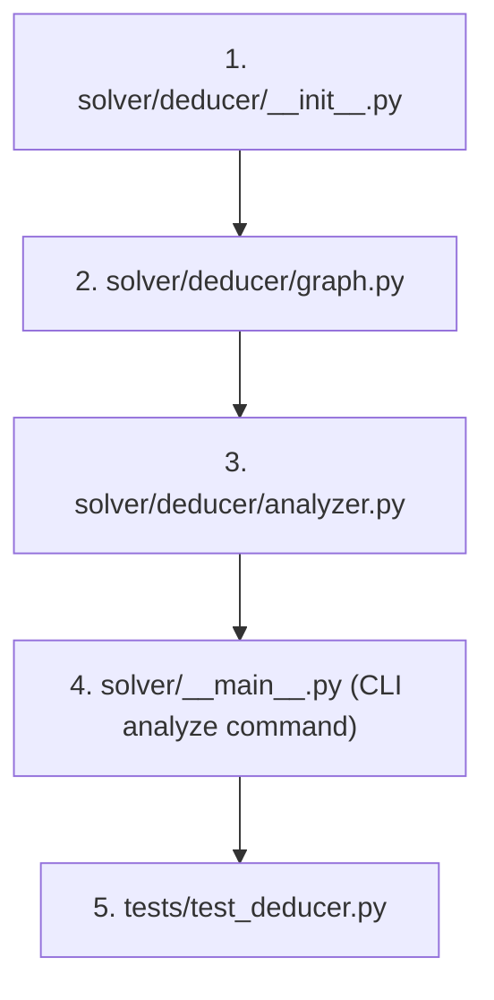

# Phase 9 — Deducer Implementation Plan

## 1. Phase Title, Goal, and Overview

### Title
**Phase 9 — Deducer (Hypothesis-Consequence Analyzer)**

### Goal
Implement network-level analysis of hypothesis-consequence relationships across formula collections, incremental dependency graph construction from proof DAGs, minimal hypothesis set identification, redundant premise detection, equivalence class clustering, and the CLI `analyze` command.

### Overview
While the automated theorem prover (**Phase 7 — Prover**) focuses on finding step-by-step refutation proof paths (`ProofDAG`) for establishing whether a specific conclusion follows from given premises ($H \vdash C$), the **Deducer** operates at a structural, network-level scale across collections of formulas and theorems.

As detailed in Section 3.15 of the master plan:
1. **Network-Level Analysis vs Single Proof Search**: The Deducer maps dependencies across entire axiom systems and theorem sets, computing transitive closures, discovering logical equivalence classes ($A \iff B$), and extracting minimal premise sets.
2. **Scalable Graph Construction**: Pairwise $O(n^2)$ proof search over large formula sets is computationally prohibitive. Instead, `DependencyGraph` is populated **incrementally from successful proofs** as theorems are established. Explicit pairwise analysis is provided as an opt-in mode (`pairwise=True`) for small formula sets.
3. **Hypothesis Optimization**: Provides automated tools (`find_minimal_hypotheses` and `detect_redundant_hypotheses`) to simplify premise sets before storage or LEAN export.

---

## 2. Prerequisites

Phase 9 depends on the completion of the following prior phases:

1. **Phase 1 — AST & Sort System** (`solver/core/ast.py`, `solver/core/sorts.py`): `Formula`, `Term`, `Variable`, `canonicalize_bound_variables()`.
2. **Phase 2 — Signature & Validator** (`solver/core/signature.py`, `solver/core/validator.py`): `Signature`, `validate_formula()`.
3. **Phase 3 — Parser & Visitor Framework** (`solver/core/parser.py`, `solver/core/visitors.py`): `parse_formula()`, `to_string()`.
4. **Phase 6 — Knowledge Base & Database** (`solver/core/database.py`, `solver/config.py`): `KnowledgeDatabase`, `SolverConfig`.
5. **Phase 7 — Prover** (`solver/prover/engine.py`, `solver/prover/proof.py`): `TheoremProver`, `ProofDAG`, `ProofStep`, `ProofTimeoutError`, `ProofSearchExhaustedError`.

---

## 3. Files to Create / Modify

| File Path | Action | Description |
| :--- | :--- | :--- |
| `solver/deducer/__init__.py` | Create | Package initialization and public exports (`DependencyGraph`, `analyze_dependencies`, `find_minimal_hypotheses`, `detect_redundant_hypotheses`, `compute_equivalence_classes`). |
| `solver/deducer/graph.py` | Create | `DependencyGraph` class definition, node/edge registration, incremental proof DAG ingestion (`register_proof`), graph traversals (`predecessors`, `successors`, `transitive_closure`), cycle detection, and serialization (`to_dict`). |
| `solver/deducer/analyzer.py` | Create | Network analysis algorithms: `analyze_dependencies`, greedy minimal hypothesis reduction (`find_minimal_hypotheses`), premise redundancy detection (`detect_redundant_hypotheses`), and bidirectional equivalence class clustering (`compute_equivalence_classes`). |
| `solver/__main__.py` | Update | CLI entry point with `analyze` command implementation. |
| `tests/test_deducer.py` | Create | Comprehensive unit and integration test suite covering dependency graph operations, incremental building, minimal hypothesis reduction, equivalence class clustering, and CLI execution. |

---

## 4. Detailed Implementation Guide

### 4.1 `solver/deducer/__init__.py`

Exports top-level classes and functions for hypothesis-consequence deduction.

```python
from solver.deducer.graph import DependencyGraph
from solver.deducer.analyzer import (
    analyze_dependencies,
    find_minimal_hypotheses,
    detect_redundant_hypotheses,
    compute_equivalence_classes,
)

__all__ = [
    "DependencyGraph",
    "analyze_dependencies",
    "find_minimal_hypotheses",
    "detect_redundant_hypotheses",
    "compute_equivalence_classes",
]
```

---

### 4.2 `solver/deducer/graph.py` (Section 3.15.1)

Defines the `DependencyGraph` data structure representing network-level implication, dependency, and equivalence relationships among named formulas.

```python
from dataclasses import dataclass, field
from typing import Dict, List, Set, Tuple, Optional, Any
import json

from solver.core.ast import Formula
from solver.core.parser import to_string
from solver.prover.proof import ProofDAG

@dataclass
class DependencyGraph:
    nodes: Dict[str, Formula] = field(default_factory=dict)
    edges: List[Tuple[str, str, str]] = field(default_factory=list)

    # Internal adjacency structures for fast lookup
    _adj_out: Dict[str, Set[Tuple[str, str]]] = field(default_factory=dict, repr=False)
    _adj_in: Dict[str, Set[Tuple[str, str]]] = field(default_factory=dict, repr=False)

    def add_node(self, name: str, formula: Formula) -> None:
        """Adds a named formula node to the graph.

        If a node with the same name exists with an identical formula, this operation is idempotent.
        If the formula differs for an existing name, raises ValueError.
        """
        if name in self.nodes:
            if self.nodes[name] != formula:
                raise ValueError(f"Node '{name}' already exists with a different formula.")
            return
        self.nodes[name] = formula
        if name not in self._adj_out:
            self._adj_out[name] = set()
        if name not in self._adj_in:
            self._adj_in[name] = set()

    def add_edge(self, source: str, target: str, relationship: str) -> None:
        """Adds a directed edge between source and target nodes with a specified relationship.

        Valid relationship strings: "implies", "equivalent", "depends".
        Raises KeyError if source or target node is not registered.
        Raises ValueError if relationship string is invalid.
        """
        valid_rels = {"implies", "equivalent", "depends"}
        if relationship not in valid_rels:
            raise ValueError(f"Invalid relationship '{relationship}'. Must be one of {valid_rels}.")
        if source not in self.nodes:
            raise KeyError(f"Source node '{source}' does not exist in graph.")
        if target not in self.nodes:
            raise KeyError(f"Target node '{target}' does not exist in graph.")

        edge = (source, target, relationship)
        if edge not in self.edges:
            self.edges.append(edge)
            self._adj_out[source].add((target, relationship))
            self._adj_in[target].add((source, relationship))

    def register_proof(self, proof: ProofDAG, theorem_name: str) -> None:
        """Incrementally updates the dependency graph from a completed proof DAG.

        Registers the conclusion (theorem_name) and adds directed "depends" / "implies" edges
        from each premise in proof.premises to theorem_name.
        """
        # Register conclusion
        self.add_node(theorem_name, proof.conclusion)

        # Ingest premises
        for idx, premise_formula in enumerate(proof.premises):
            premise_name = f"premise_{idx}"
            # Check if premise formula matches an existing node
            for existing_name, existing_formula in self.nodes.items():
                if existing_formula == premise_formula:
                    premise_name = existing_name
                    break
            
            self.add_node(premise_name, premise_formula)
            self.add_edge(premise_name, theorem_name, "implies")

    def predecessors(self, name: str) -> List[str]:
        """Returns a list of direct predecessor node names (nodes that point to `name`)."""
        if name not in self.nodes:
            raise KeyError(f"Node '{name}' does not exist in graph.")
        return sorted([src for src, _ in self._adj_in.get(name, set())])

    def successors(self, name: str) -> List[str]:
        """Returns a list of direct successor node names (nodes that `name` points to)."""
        if name not in self.nodes:
            raise KeyError(f"Node '{name}' does not exist in graph.")
        return sorted([tgt for tgt, _ in self._adj_out.get(name, set())])

    def transitive_closure(self, name: str) -> Set[str]:
        """Computes the set of all node names reachable from the given node via directed edges.

        Uses Breadth-First Search (BFS) to traverse outward dependencies.
        """
        if name not in self.nodes:
            raise KeyError(f"Node '{name}' does not exist in graph.")

        visited: Set[str] = set()
        queue: List[str] = [name]
        while queue:
            curr = queue.pop(0)
            for succ in self.successors(curr):
                if succ not in visited and succ != name:
                    visited.add(succ)
                    queue.append(succ)
        return visited

    def is_acyclic_modulo_equivalence(self) -> bool:
        """Returns True if the graph has no directed cycles other than those within "equivalent" components."""
        # Filter out edges marked as 'equivalent' to test acyclicity of implications
        non_eq_edges = [(src, tgt) for src, tgt, rel in self.edges if rel != "equivalent"]
        adj: Dict[str, List[str]] = {node: [] for node in self.nodes}
        for src, tgt in non_eq_edges:
            adj[src].append(tgt)

        visited: Dict[str, int] = {node: 0 for node in self.nodes} # 0=unvisited, 1=visiting, 2=visited

        def dfs(u: str) -> bool:
            visited[u] = 1
            for v in adj[u]:
                if visited[v] == 1:
                    return True  # Cycle found
                if visited[v] == 0:
                    if dfs(v):
                        return True
            visited[u] = 2
            return False

        for node in self.nodes:
            if visited[node] == 0:
                if dfs(node):
                    return False
        return True

    def to_dict(self) -> Dict[str, Any]:
        """Serializes the graph into a dictionary suitable for JSON export and visualization."""
        return {
            "nodes": [
                {
                    "id": name,
                    "label": name,
                    "formula": to_string(formula)
                }
                for name, formula in self.nodes.items()
            ],
            "edges": [
                {
                    "source": src,
                    "target": tgt,
                    "relationship": rel
                }
                for src, tgt, rel in self.edges
            ]
        }
```

#### Implementation Notes & Edge Cases
- **Idempotency**: Adding the same node with an identical formula multiple times is safe and returns without modifying state.
- **Edge Validation**: Attempting to add an edge pointing to or from a non-existent node raises a `KeyError`.
- **Serialization**: `to_dict()` produces a dictionary compatible with standard graph visualizers and `GraphExporter` (Phase 10).

---

### 4.3 `solver/deducer/analyzer.py` (Section 3.15.2)

Implements high-level network analysis algorithms over collections of formulas using `TheoremProver`.

```python
from typing import List, Tuple, Set, Optional, Dict
import logging

from solver.core.ast import Formula
from solver.core.substitutions import canonicalize_bound_variables
from solver.prover.engine import TheoremProver
from solver.prover.proof import ProofDAG
from solver.core.exceptions import ProofTimeoutError, ProofSearchExhaustedError
from solver.deducer.graph import DependencyGraph

logger = logging.getLogger(__name__)

def analyze_dependencies(
    formulas: List[Tuple[str, Formula]],
    prover: TheoremProver,
    pairwise: bool = False
) -> DependencyGraph:
    """Builds a DependencyGraph across a collection of named formulas.

    Args:
        formulas: List of (name, formula) tuples.
        prover: TheoremProver instance configured with timeout and search settings.
        pairwise: If True, attempts all O(n^2) pairwise implication proofs.
                  If False (default), builds graph incrementally from existing node formulas.

    Returns:
        DependencyGraph populated with nodes and proved implication/equivalence edges.
    """
    graph = DependencyGraph()

    for name, formula in formulas:
        graph.add_node(name, formula)

    if not pairwise:
        logger.info("Building DependencyGraph incrementally (pairwise=False).")
        return graph

    logger.info(f"Running pairwise dependency analysis over {len(formulas)} formulas (O(n^2)).")
    n = len(formulas)
    proved_pairs: Set[Tuple[str, str]] = set()

    for i in range(n):
        name_i, f_i = formulas[i]
        for j in range(n):
            if i == j:
                continue
            name_j, f_j = formulas[j]

            # Attempt proof f_i |- f_j
            try:
                proof = prover.prove_theorem(hypotheses=[f_i], target=f_j)
                if proof is not None:
                    proved_pairs.add((name_i, name_j))
            except (ProofTimeoutError, ProofSearchExhaustedError, Exception) as e:
                logger.debug(f"Pairwise proof failed for {name_i} |- {name_j}: {e}")

    # Process relationships
    for src, tgt in proved_pairs:
        if (tgt, src) in proved_pairs:
            graph.add_edge(src, tgt, "equivalent")
        else:
            graph.add_edge(src, tgt, "implies")

    return graph


def find_minimal_hypotheses(
    target: Formula,
    available_hypotheses: List[Formula],
    prover: TheoremProver
) -> List[Formula]:
    """Extracts a minimal sufficient subset of hypotheses for proving the target formula.

    Uses a greedy elimination algorithm: tests whether target remains provable when removing
    each hypothesis one by one. If provable without h, h is discarded.

    Args:
        target: Target conclusion formula.
        available_hypotheses: Initial candidate list of hypothesis formulas.
        prover: TheoremProver instance.

    Returns:
        A minimal subset of hypotheses sufficient to prove target.

    Raises:
        ValueError: If target is not provable from available_hypotheses.
    """
    # 1. Verify initial provability
    try:
        baseline_proof = prover.prove_theorem(hypotheses=available_hypotheses, target=target)
        if baseline_proof is None:
            raise ValueError("Target formula is not provable from the provided hypotheses.")
    except (ProofTimeoutError, ProofSearchExhaustedError, Exception) as e:
        raise ValueError(f"Target formula is not provable from the provided hypotheses: {e}")

    # 2. Greedy elimination pass
    minimal_set = list(available_hypotheses)
    
    for hyp in list(available_hypotheses):
        candidate_set = [h for h in minimal_set if h != hyp]
        try:
            proof = prover.prove_theorem(hypotheses=candidate_set, target=target)
            if proof is not None:
                # Target remains provable without hyp -> hyp is redundant
                minimal_set = candidate_set
        except (ProofTimeoutError, ProofSearchExhaustedError):
            # Target is NOT provable without hyp -> hyp is required
            pass

    return minimal_set


def detect_redundant_hypotheses(
    hypotheses: List[Formula],
    target: Formula,
    prover: TheoremProver
) -> List[Formula]:
    """Identifies all redundant hypotheses in a premise set for a target formula.

    A hypothesis h is redundant if (hypotheses \\ {h}) is sufficient to prove target.
    Unlike find_minimal_hypotheses (which returns a single minimal subset), this function
    tests each hypothesis independently against the full remaining set.

    Args:
        hypotheses: Candidate list of hypothesis formulas.
        target: Target conclusion formula.
        prover: TheoremProver instance.

    Returns:
        List of hypotheses that can be individually removed without losing provability.
    """
    # 1. Verify baseline provability
    try:
        baseline_proof = prover.prove_theorem(hypotheses=hypotheses, target=target)
        if baseline_proof is None:
            raise ValueError("Target formula is not provable from the provided hypotheses.")
    except (ProofTimeoutError, ProofSearchExhaustedError, Exception) as e:
        raise ValueError(f"Target formula is not provable from the provided hypotheses: {e}")

    redundant: List[Formula] = []

    for hyp in hypotheses:
        candidate_set = [h for h in hypotheses if h != hyp]
        try:
            proof = prover.prove_theorem(hypotheses=candidate_set, target=target)
            if proof is not None:
                redundant.append(hyp)
        except (ProofTimeoutError, ProofSearchExhaustedError):
            pass

    return redundant


def compute_equivalence_classes(
    formulas: List[Tuple[str, Formula]],
    prover: TheoremProver
) -> List[Set[str]]:
    """Groups formula names into logical equivalence classes where formulas mutually imply each other (A <=> B).

    Fast-paths syntactic alpha-equivalence via canonicalize_bound_variables, then invokes
    bidirectional prover calls for remaining pairs.

    Args:
        formulas: List of (name, formula) tuples.
        prover: TheoremProver instance.

    Returns:
        List of sets of formula names, where each set contains mutually equivalent formulas.
    """
    if not formulas:
        return []

    # Disjoint Set Union (DSU) for equivalence grouping
    parent: Dict[str, str] = {name: name for name, _ in formulas}

    def find(i: str) -> str:
        if parent[i] == i:
            return i
        parent[i] = find(parent[i])
        return parent[i]

    def union(i: str, j: str) -> None:
        root_i = find(i)
        root_j = find(j)
        if root_i != root_j:
            parent[root_i] = root_j

    # 1. Fast-path: Group by canonical alpha-equivalence
    canonical_map: Dict[str, str] = {}
    for name, formula in formulas:
        canon_key = str(canonicalize_bound_variables(formula))
        if canon_key in canonical_map:
            union(name, canonical_map[canon_key])
        else:
            canonical_map[canon_key] = name

    # 2. Semantic proving pass across representative formulas
    representatives = list(canonical_map.items())
    n = len(representatives)

    for i in range(n):
        canon_i, name_i = representatives[i]
        formula_i = dict(formulas)[name_i]
        for j in range(i + 1, n):
            canon_j, name_j = representatives[j]
            formula_j = dict(formulas)[name_j]

            if find(name_i) == find(name_j):
                continue

            # Check bidirectional proof: f_i |- f_j and f_j |- f_i
            try:
                proof_ij = prover.prove_theorem(hypotheses=[formula_i], target=formula_j)
                if proof_ij is not None:
                    proof_ji = prover.prove_theorem(hypotheses=[formula_j], target=formula_i)
                    if proof_ji is not None:
                        union(name_i, name_j)
            except (ProofTimeoutError, ProofSearchExhaustedError, Exception):
                pass

    # Collect equivalence classes
    classes_dict: Dict[str, Set[str]] = {}
    for name, _ in formulas:
        root = find(name)
        if root not in classes_dict:
            classes_dict[root] = set()
        classes_dict[root].add(name)

    return list(classes_dict.values())
```

#### Implementation Notes & Algorithms

1. **Greedy Elimination (`find_minimal_hypotheses`)**:
   - Order of iteration matters for greedy elimination. By processing hypotheses in the order provided, it systematically tests removing each premise.
   - If a premise removal times out or fails, `ProofTimeoutError` / `ProofSearchExhaustedError` is caught, ensuring the algorithm stays robust and preserves necessary premises.

2. **DSU Equivalence Clustering (`compute_equivalence_classes`)**:
   - Combining syntactic alpha-equivalence (`canonicalize_bound_variables`) with semantic bidirectional proving dramatically reduces the required prover calls from $O(n^2)$ to $O(k^2)$ where $k \ll n$ is the number of syntactically distinct formulas.

---

### 4.4 Update CLI Entry Point `solver/__main__.py`

Integrates the `analyze` subcommand into the CLI interface.

```python
# Add to solver/__main__.py

import argparse
import json
from pathlib import Path
from solver.config import SolverConfig
from solver.core.database import KnowledgeDatabase
from solver.prover.engine import TheoremProver
from solver.deducer.analyzer import (
    analyze_dependencies,
    find_minimal_hypotheses,
    compute_equivalence_classes,
)

def setup_analyze_parser(subparsers: argparse._SubParsersAction) -> None:
    """Configures the 'analyze' CLI subcommand."""
    parser = subparsers.add_parser(
        "analyze",
        help="Analyze network dependencies and hypothesis-consequence relationships"
    )
    parser.add_argument(
        "--db",
        default="solver_data.db",
        help="Path to SQLite database (default: solver_data.db)"
    )
    parser.add_argument(
        "--category",
        default=None,
        help="Filter database theorems by category"
    )
    parser.add_argument(
        "--pairwise",
        action="store_true",
        help="Perform opt-in O(n^2) pairwise implication proofs"
    )
    parser.add_argument(
        "--output",
        default=None,
        help="Output JSON file path for exported DependencyGraph"
    )
    parser.set_defaults(func=handle_analyze)


def handle_analyze(args: argparse.Namespace) -> None:
    """Executes the 'analyze' CLI subcommand."""
    config = SolverConfig()
    if Path(args.db).exists():
        config.db_path = args.db

    db = KnowledgeDatabase(config.db_path)
    theorems = db.get_all_theorems(category=args.category)

    if not theorems:
        print(f"No theorems found in database '{config.db_path}'.")
        return

    formulas = [(t.name, t.formula) for t in theorems]
    prover = TheoremProver(config=config)

    print(f"Analyzing network dependencies for {len(formulas)} theorems...")
    graph = analyze_dependencies(formulas, prover, pairwise=args.pairwise)

    eq_classes = compute_equivalence_classes(formulas, prover)

    print("\n--- Analysis Summary ---")
    print(f"Total Nodes (Formulas): {len(graph.nodes)}")
    print(f"Total Directed Edges:   {len(graph.edges)}")
    print(f"Equivalence Classes:    {len(eq_classes)}")

    for idx, eq_set in enumerate(eq_classes, 1):
        if len(eq_set) > 1:
            print(f"  Class {idx}: {sorted(list(eq_set))}")

    if args.output:
        with open(args.output, "w", encoding="utf-8") as f:
            json.dump(graph.to_dict(), f, indent=2)
        print(f"\nDependency graph exported to '{args.output}'.")
```

---

## 5. Step-by-Step Implementation Order



1. **`solver/deducer/__init__.py`**:
   - Create package module and expose public symbols (`DependencyGraph`, `analyze_dependencies`, `find_minimal_hypotheses`, `detect_redundant_hypotheses`, `compute_equivalence_classes`).
2. **`solver/deducer/graph.py`**:
   - Implement `DependencyGraph` dataclass.
   - Add node and edge registration, validation, adjacency lookup, `register_proof`, `transitive_closure`, `is_acyclic_modulo_equivalence`, and `to_dict` serialization.
3. **`solver/deducer/analyzer.py`**:
   - Implement `analyze_dependencies` with incremental and pairwise modes.
   - Implement `find_minimal_hypotheses` greedy elimination algorithm.
   - Implement `detect_redundant_hypotheses`.
   - Implement `compute_equivalence_classes` with syntactic fast-path + semantic DSU proving.
4. **`solver/__main__.py`**:
   - Register `analyze` CLI subcommand and implement `handle_analyze`.
5. **`tests/test_deducer.py`**:
   - Implement comprehensive unit and integration tests.

---

## 6. Testing Requirements

### 6.1 Test File: `tests/test_deducer.py`

#### Unit Test Cases:
1. **`test_dependency_graph_basic_operations`**:
   - Test adding nodes and edges.
   - Test idempotent node addition.
   - Verify `KeyError` on edge creation with missing nodes.
   - Verify `ValueError` on invalid relationship types.
2. **`test_dependency_graph_traversals`**:
   - Create DAG: $A \to B \to C$ and $A \to D$.
   - Test `predecessors("C")` returns `["B"]`.
   - Test `successors("A")` returns `["B", "D"]`.
   - Test `transitive_closure("A")` returns `{"B", "C", "D"}`.
3. **`test_register_proof_incremental`**:
   - Construct a dummy `ProofDAG` with conclusion $C$ and premises $A, B$.
   - Call `graph.register_proof(proof, "Theorem_C")`.
   - Verify nodes `Theorem_C`, `premise_0`, `premise_1` exist and edges `premise_0 -> Theorem_C`, `premise_1 -> Theorem_C` are created with relationship `"implies"`.
4. **`test_graph_serialization`**:
   - Serialize graph using `to_dict()` and assert exact schema dictionary keys (`nodes`, `edges`).

#### Integration Test Cases:
5. **`test_find_minimal_hypotheses`**:
   - Create hypotheses $H_1: P(a)$, $H_2: Q(a)$, $H_3: P(a) \implies R(a)$.
   - Target $T: R(a)$.
   - Call `find_minimal_hypotheses(T, [H_1, H_2, H_3], prover)`.
   - Assert return value contains exactly $[H_1, H_3]$ (removing redundant $H_2$).
6. **`test_detect_redundant_hypotheses`**:
   - Same hypotheses and target as above.
   - Call `detect_redundant_hypotheses([H_1, H_2, H_3], T, prover)`.
   - Assert return list contains exactly $[H_2]$.
7. **`test_compute_equivalence_classes_syntactic_and_semantic`**:
   - Define formulas $F_1 = P(a) \implies Q(a)$, $F_2 = \neg P(a) \lor Q(a)$ (logically equivalent), and $F_3 = R(a)$.
   - Call `compute_equivalence_classes([("F1", F1), ("F2", F2), ("F3", F3)], prover)`.
   - Assert equivalence classes contain `{"F1", "F2"}` and `{"F3"}`.
8. **`test_analyze_dependencies_pairwise`**:
   - Test `analyze_dependencies(formulas, prover, pairwise=True)` constructs valid edges between provable pairs.

---

## 7. Acceptance Criteria

- [ ] `DependencyGraph` successfully maintains nodes and directed implication/equivalence edges.
- [ ] `DependencyGraph.register_proof` incrementally ingests `ProofDAG` premises and conclusions.
- [ ] `find_minimal_hypotheses` greedily reduces premise sets to minimal sufficient subsets.
- [ ] `detect_redundant_hypotheses` correctly flags premises that do not affect target provability.
- [ ] `compute_equivalence_classes` partitions formulas using syntactic fast-paths and bidirectional proofs.
- [ ] `analyze_dependencies` supports both incremental building and opt-in `pairwise=True` mode.
- [ ] CLI `analyze` command executes cleanly and outputs network summary statistics or exports JSON.
- [ ] All unit and integration tests in `tests/test_deducer.py` pass cleanly.

---

## 8. Risks and Mitigations

| Risk | Impact | Mitigation Strategy |
| :--- | :--- | :--- |
| **$O(n^2)$ Pairwise Prover Explosion** | Prover times out or hangs on large formula collections | Make `pairwise=False` the default; enforce strict `prover_timeout_sec` (e.g. 5.0s) in `SolverConfig`. |
| **Non-termination during Minimal Set Search** | Greedy elimination loop hangs on complex premises | Catch `ProofTimeoutError` and `ProofSearchExhaustedError` exceptions during elimination attempts, treating timeouts as proof failures (retaining the premise). |
| **Cyclic Implication Graphing** | Transitive closure infinite loops | Track a `visited` set in graph traversals; represent mutual implications with `"equivalent"` relationship edges. |
| **Unsound Equivalence Union** | Merging non-equivalent classes if one direction fails | Require **both** $A \vdash B$ and $B \vdash A$ to succeed before performing DSU `union`. |
